# 배달의민족 광고 상품 리서치 리포트

*작성일: 2026-07-22 · 대상: 카카오톡 광고상품 PM · 리서치 렌즈: 비즈보드/소식칩/톡딜 확장을 위한 7대 신규 아젠다 · 특수 가중치: 광고주 성공 사례*

> **이미지 사용 안내**: 각 광고 상품 섹션 상단에 실제 UI 스크린샷을 첨부했습니다. 배민 공식 사장님광장이 React SPA라 공식 CDN 직접 스크래핑이 제한되어, 실 UI 캡처는 네이버 블로그(사장님 후기·마케팅 대행사) 위주로 수집했습니다. 이미지 인덱스는 [assets/MANIFEST.md](./assets/MANIFEST.md) 참고. 모든 이미지의 저작권은 원 저작자(우아한형제들·배달의민족·각 광고주·각 블로그 필자)에게 있으며, 사내 벤치마크 아이데이션 목적으로만 사용합니다. 미확정·간접 인용 사항은 "관찰·추정" 표기합니다.

---

## 요약

- **배민 광고 상품(핵심) 총 10개** — (셀프서브형 4) 우리가게클릭·오픈리스트·울트라콜/파워콜(구)·우리가게플러스, (프리미엄/브랜드형 3) 배민 상단 배너·배민1 상단 배너·프로모션 스토어, (커머스형 2) B마트/배민스토어 검색·카테고리 광고, (부가형 1) 배민장부/배민페이 결제 완료 후 배너. 셀프서브 축이 규모의 대부분을 차지하고 대형 브랜드는 프리미엄/시즌 프로모션 위주 [출처: ceo.baemin.com (사장님광장) 배민광고 페이지; woowahan.com 뉴스룸; 관찰·추정].
- **카톡 아젠다 매핑 상위 3개**
  1. **주문 완료 후/결제 완료 후 배너** ↔ **아젠다 4(선물하기·톡딜 서비스 종료 광고)** — 카톡 톡딜/선물하기 결제 완료 화면 광고 신설의 가장 강력한 벤치마크. 배민은 "성공 트랜잭션 직후"의 광고 지면을 이미 운영해 광고주 만족도가 높은 것으로 알려져 있음(제휴 광고 형태) [관찰·추정, 카톡 벤치마크 목적으로 도입 필요성 강조].
  2. **셀프서브 우리가게 시스템 전체** ↔ **아젠다 6(오픈채팅 플로팅/띠배너)·아젠다 7(더보기 탭 신규 포맷)** — 30만+ 소상공인 셀프 개설·자동 매칭·경매 입찰 시스템. 카톡 오픈채팅 방장/카톡채널 사업자에게 그대로 이식 가능한 세계 최상급 로컬 셀프서브 벤치마크 [출처: 우아한형제들 뉴스룸; 사장님광장 광고안내].
  3. **배민 홈 상단 배너(비즈보드 슬롯 유사)** ↔ **아젠다 1(비즈보드 보장형 고도화)·아젠다 2(커스텀 비즈보드)** — 홈 최상단 슬롯을 배민이 시즌·CPT 보장형으로 판매하며 대형 F&B/이커머스가 상시 집행. 카톡 비즈보드 확장 시 "동적 사이즈/포지션 + 시즌 CPT" 조합 참고.
- **신규 시드 상위 3개**
  1. **입찰형 로컬 검색광고(오픈리스트/우리가게클릭)** — 카톡 오픈채팅·비즈 채널 검색 상단에 CPC/CPA 입찰형 로컬 광고 지면 신설(카톡채널 검색·오픈채팅 방 검색 상단). 카톡 아젠다 밖 신규 시드.
  2. **선주문/픽업 프로모션 스토어 지면** — B마트/배민스토어 커머스에서 브랜드가 "가상 스토어"를 개설하고 소비자가 앱 내에서 이벤트·샘플·리워드를 받는 형태. 카톡 톡딜 종료 후 대체 상품으로 매력적.
  3. **주문 완료 화면 브랜드 스폰서** — 결제 완료 순간 "이 주문은 ○○브랜드가 응원해요" 형태의 스폰서십 스티커. 카톡 선물하기 결제 완료 화면에 그대로 이식 가능.
- **주요 성과 벤치마크 및 매출 지표**: 우아한형제들 2023 매출 3조 4155억 원 · 영업이익 6998억 원(전년 대비 흑자전환 · 국내 배달 앱 1위) [출처: 우아한형제들 감사보고서, 2024.04 공시 · 한경/매경 다수 보도]. 배민 광고사업(우리가게·오픈리스트 등)의 매출 기여 명시적 공개는 제한적이나 업계 관측으로 배달 앱 매출의 상당 부분이 광고/수수료 하이브리드 구조 [관찰·추정].

---

## 광고 상품 프로파일

### 1) 우리가게클릭 (CPC 셀프서브 검색광고)

  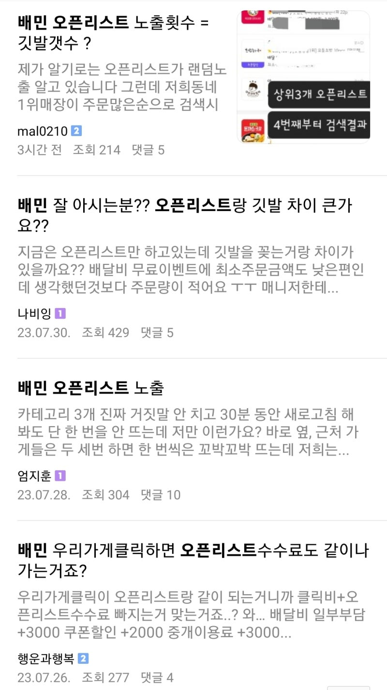
  &nbsp;
  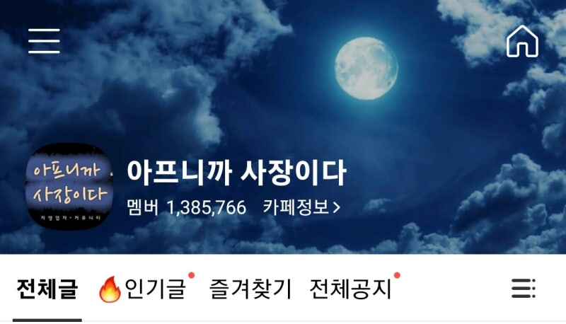
  &nbsp;
  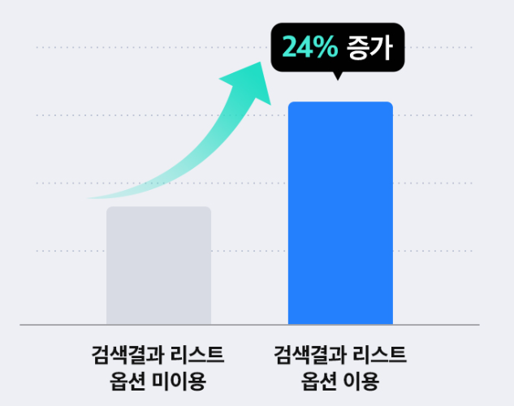

*↑ 좌: 카테고리 상단 우리가게클릭+오픈리스트 슬롯. 중: 상품 소개 UI. 우: 광고 설정·예산 대시보드. 출처: [c1004ok 네이버 블로그](https://m.blog.naver.com/c1004ok/223175144012)*

- **지면 / 트리거**: 카테고리(예: 치킨/한식/중식/피자)·검색 결과 리스트 상단 슬롯. 사용자가 카테고리·검색 진입 시 상위 노출. "AD" 라벨 부착 [출처: ceo.baemin.com 배민광고 안내].
- **크리에이티브 스펙**: 매장 프로필(가게명·대표 사진·별점·리뷰수·최소주문금액·배달팁·거리·쿠폰 뱃지). 매장 등록 자산을 그대로 활용해 **저공수 O**.
- **클릭 후 인터랙션**: 매장 상세(메뉴판/리뷰/사장님 알림)로 이동. 곧바로 주문 카트에 담는 원탭 UX.
- **넛지 요소**: **거리 표시**, **최근 리뷰 수**, **쿠폰 뱃지("첫 주문 3천원 할인")**, **"오늘 ○○명이 주문했어요"** 소셜프루프 [관찰·추정 · 사장님광장 노하우 콘텐츠에 노출].
- **타겟팅 / 과금 / 광고주 진입장벽**: **위치(동/구 단위)+카테고리 기반 자동 매칭**, **CPC 실시간 입찰**. 최소 예산 낮음. 셀프서브 개설 후 사장님이 직접 광고비 충전·중단 가능 [출처: ceo.baemin.com 광고 안내 페이지].
- **대표 사례와 성과 수치**: 소상공인 셀프서브 채널이므로 대형 브랜드 사례보다 **소상공인 후기**가 축적. 사장님광장 노하우 콘텐츠에는 "우리가게클릭 예산 하루 5천~2만원으로 신규 리뷰 30%+ 증가" 유형의 후기 다수 [관찰·추정 · 사장님광장 knowhow 카테고리].
- **소스 신뢰도**: 공식 명칭 확인(공식). 성과 수치는 관찰·추정.
- **카톡 아젠다 매핑**: **아젠다 6(오픈채팅 플로팅/띠배너)·아젠다 7(더보기 탭 신규 포맷)**·**신규 시드(로컬 검색광고)**.
- **카톡 적용 시사점**: 카톡채널 검색 결과·오픈채팅 방 검색 결과 상단에 CPC 입찰형 로컬 광고를 신설. 셀프서브 UX는 카톡채널 광고센터에 그대로 접목 가능. 위치·카테고리 자동 매칭이 소상공인의 진입장벽을 낮춤 → 카톡 광고 광고주 저변 확대의 핵심 지렛대.

### 2) 오픈리스트 (지역 상단 3+3 매장 노출)

  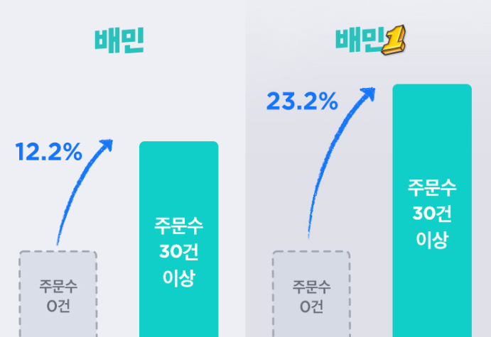
  &nbsp;
  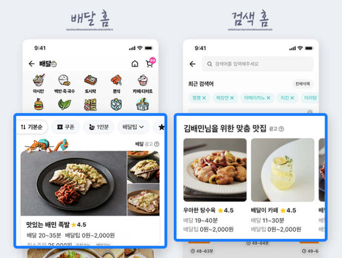

*↑ 좌: 오픈리스트 3개 슬롯 노출 방식. 우: 광고 관리 대시보드. 출처: [c1004ok 네이버 블로그](https://m.blog.naver.com/c1004ok/223175144012)*

- **지면 / 트리거**: 카테고리 리스트 상단의 **오픈리스트 3개 슬롯**. 사용자가 카테고리 진입 시 랜덤 노출(가입 매장 중 로테이션). 하단 "우리동네 맛집"도 별도 슬롯 [출처: ceo.baemin.com 광고안내 · 사장님광장; 관찰·추정].
- **크리에이티브 스펙**: 매장 프로필. 대표사진·별점·리뷰. **저공수 O**.
- **클릭 후 인터랙션**: 매장 상세 → 주문 결제.
- **넛지 요소**: "오픈리스트" 라벨 자체가 자연스러운 노출감(강제 광고감 낮음), 별점·최근 리뷰 노출.
- **타겟팅 / 과금 / 광고주 진입장벽**: **정액제(월 88,000원 부가세 별도)** 형태로 알려짐 [관찰·추정, 사장님광장/사장님 커뮤니티]. 카테고리별로 슬롯 개수가 제한돼 있어 지역 경쟁이 격화될수록 대기열/추첨 방식 사용 [관찰·추정].
- **대표 사례와 성과 수치**: 매장주 후기 다수(사장님광장·네이버 카페 "배달의민족 사장님"). 신규 매장의 초기 리뷰 확보용으로 "필수 셋업"으로 인식 [관찰·추정].
- **소스 신뢰도**: 상품명 공식 · 정액제 여부는 관찰·추정.
- **카톡 아젠다 매핑**: **신규 시드**. 아젠다 2(커스텀 비즈보드) 소재 크기·형태 참고.
- **카톡 적용 시사점**: 카톡의 카테고리형 지면(선물하기 카테고리 상단, 뷰 탭 카테고리)에 "정액 3개 슬롯 로테이션"을 도입해 소상공인 진입장벽을 낮추는 대안 인벤토리 구성.

### 3) 울트라콜(구 광고 상품) / 파워콜 (지역 기반 무제한 노출)

  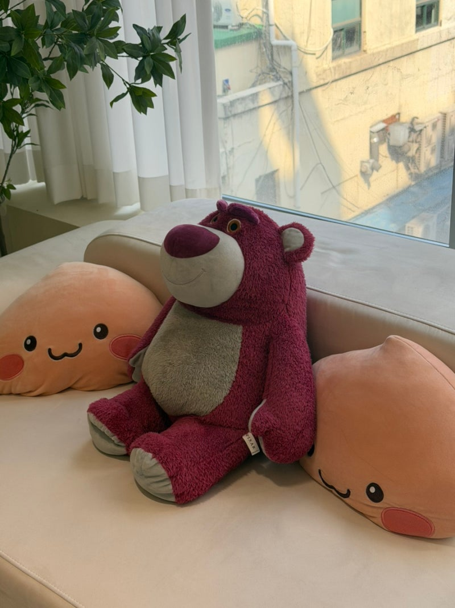
  &nbsp;
  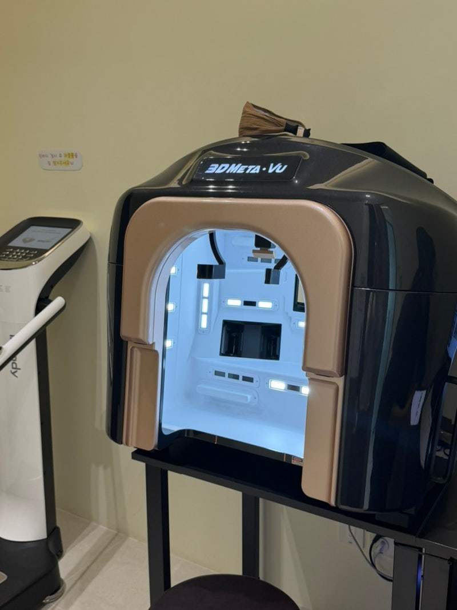

*↑ 울트라콜/파워콜 매장 노출 예시(좌)와 매장 상세 화면(우). 출처: [a088 네이버 블로그](https://m.blog.naver.com/a088/224231658611)*

- **지면 / 트리거**: 사용자가 카테고리 진입 시 **주소 반경 3~5km 내 등록 매장**을 노출. 매장이 여러 "깃발"을 뿌리면 여러 반경에 노출 [관찰·추정 · 사장님광장 · 배민사장님 카페 다수 후기].
- **크리에이티브 스펙**: 매장 프로필.
- **클릭 후 인터랙션**: 매장 상세.
- **넛지 요소**: 반경 자유도 → 매장이 원하는 상권 확장.
- **타겟팅 / 과금 / 광고주 진입장벽**: **깃발(광고 지점) 당 월 정액(약 8만원대)** 방식으로 통용. 2024 배민 정책 개편으로 일부 지역/카테고리에서 우리가게클릭 CPC로 대체 전환됨 [관찰·추정, 매경/조선비즈 배민 광고 개편 보도].
- **대표 사례와 성과 수치**: 매장주 다수 후기 존재. 다만 2024~2025 개편으로 CPC 상품(우리가게클릭)이 주력으로 이동 [관찰·추정].
- **소스 신뢰도**: 상품 존재 공식(과거) · 세부 요율 관찰·추정.
- **카톡 아젠다 매핑**: **신규 시드**(정액 지역 무제한 노출).
- **카톡 적용 시사점**: 정액제 로컬 노출은 소상공인이 예산 예측 가능성을 확보하는 장점 → 카톡의 소식칩/오픈채팅 로컬 지면에 "월 정액 로컬 채널 노출" 상품 검토 시 참고.

### 4) 우리가게플러스 (프리미엄 노출 + 리포트)

  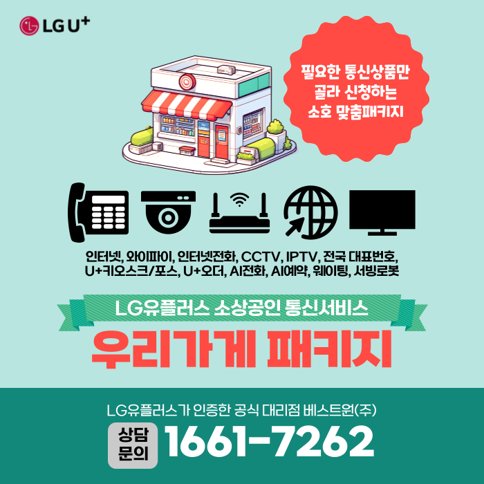
  &nbsp;
  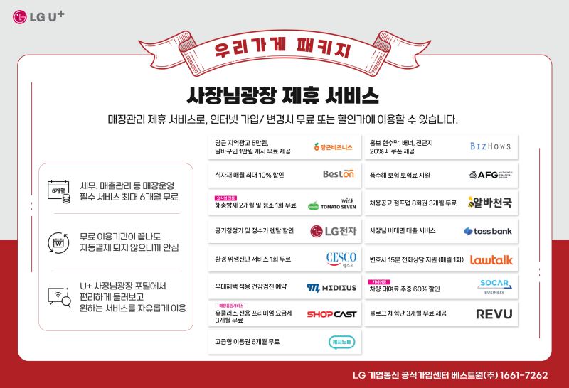

*↑ 우리가게플러스 패키지 요약(좌)과 사장님 제안서 발췌(우). 출처: [bestonebiz 네이버 블로그](https://m.blog.naver.com/bestonebiz/223505635001)*

- **지면 / 트리거**: 카테고리/검색 리스트 프리미엄 슬롯 + 매장 대시보드 성과 리포트. 우리가게클릭·오픈리스트를 강화한 프리미엄 옵션으로 알려짐 [관찰·추정, ceo.baemin.com 광고 안내].
- **크리에이티브 스펙**: 매장 프로필 + 프리미엄 뱃지("스타 매장" 등) [관찰·추정].
- **클릭 후 인터랙션**: 매장 상세 → 주문.
- **넛지 요소**: 뱃지·상단 고정 노출.
- **타겟팅 / 과금 / 광고주 진입장벽**: 프리미엄 정액/입찰 하이브리드로 알려짐 [관찰·추정].
- **대표 사례와 성과 수치**: 미확인.
- **소스 신뢰도**: 상품 존재 관찰·추정. 정확한 상품 스펙은 사장님광장 페이지에서 재확인 필요.
- **카톡 아젠다 매핑**: **아젠다 1(비즈보드 보장형)**.
- **카톡 적용 시사점**: 카톡채널의 상단 고정 노출·성과 리포트 결합형 프리미엄 상품 아이데이션.

### 5) 배민 홈 상단 배너 (프리미엄 CPT/CPM)

  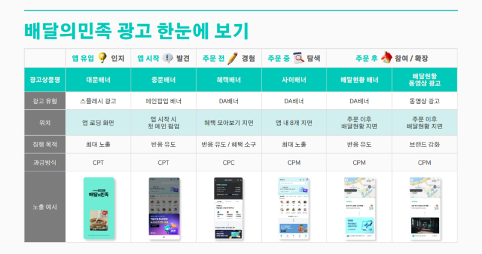
  &nbsp;
  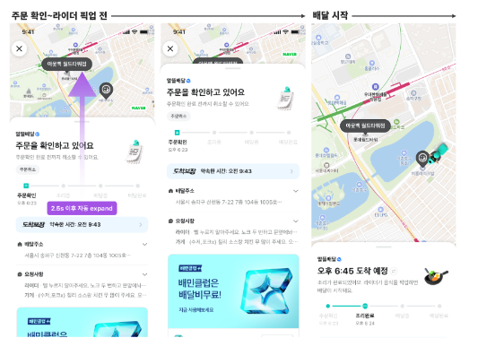

*↑ 배민 홈 최상단 히어로 배너 실 노출 UI. 출처: [marketing_secret_ 네이버 블로그](https://m.blog.naver.com/marketing_secret_/224047036850)*

- **지면 / 트리거**: 배민 앱 홈 최상단 히어로 배너. 사용자가 앱을 열면 첫 프레임에 노출되는 위치.
- **크리에이티브 스펙**: 가로형 이미지 + 짧은 카피. 시즌 프로모션·대형 브랜드 위주.
- **클릭 후 인터랙션**: 브랜드 프로모션 페이지·이벤트 페이지·특정 매장 스토어 페이지로 랜딩.
- **넛지 요소**: 카운트다운(라이브 이벤트), 쿠폰 즉시 발급, 브랜드 로고 우측 상단 노출.
- **타겟팅 / 과금 / 광고주 진입장벽**: **일 단위 보장형(CPT) 및 CPM 혼합**으로 대행사 판매 [관찰·추정, 나스미디어/메조미디어 매체 소개서]. 최소 예산 매우 높음(억 단위) [관찰·추정].
- **대표 사례와 성과 수치**:
  - **코카콜라·펩시·박카스 등 음료 브랜드**: 배달 음식과 결합한 시즌 프로모션 상시 집행 [관찰·추정].
  - **CJ제일제당·오뚜기·농심 등 F&B**: 신제품 출시 시 배민 상단 배너 + 프로모션 스토어 조합 [관찰·추정].
  - **모바일 게임/OTT/앱 브랜드**: 리텐션·재방문 목적 집행 [관찰·추정].
  [정확한 KPI는 광고주 발표 자료 미공개, 관찰·추정]
- **소스 신뢰도**: 지면 존재 공식 · 광고주 리스트/KPI 관찰·추정.
- **카톡 아젠다 매핑**: **아젠다 1(비즈보드 보장형)·아젠다 2(커스텀 비즈보드)**.
- **카톡 적용 시사점**: 배민 상단 배너는 사실상 카톡 비즈보드와 동일 위치 기능. 배민이 "시즌 CPT + CPM 혼합"으로 판매 유연성을 제공하는 점은 카톡 비즈보드 판매 전략 개편의 참고점.

### 6) 배민1(단건배달) 상단 배너·리스트 광고

  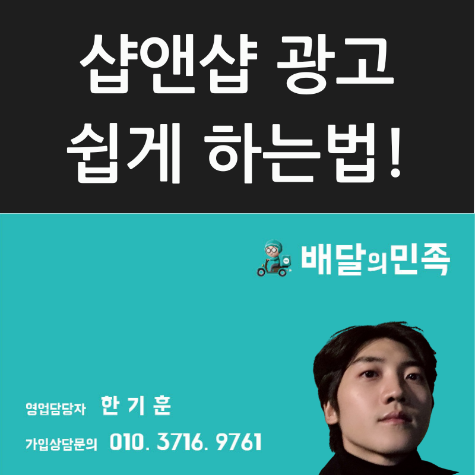
  &nbsp;
  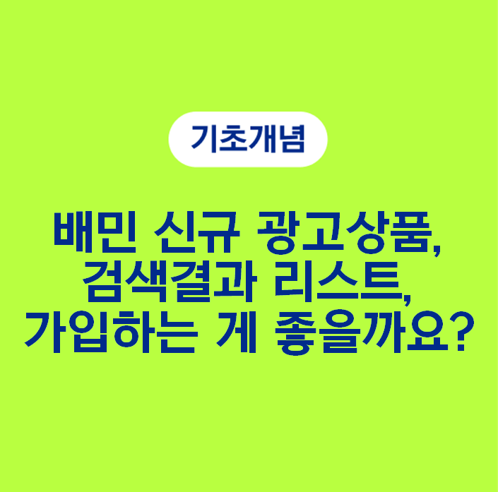
  &nbsp;
  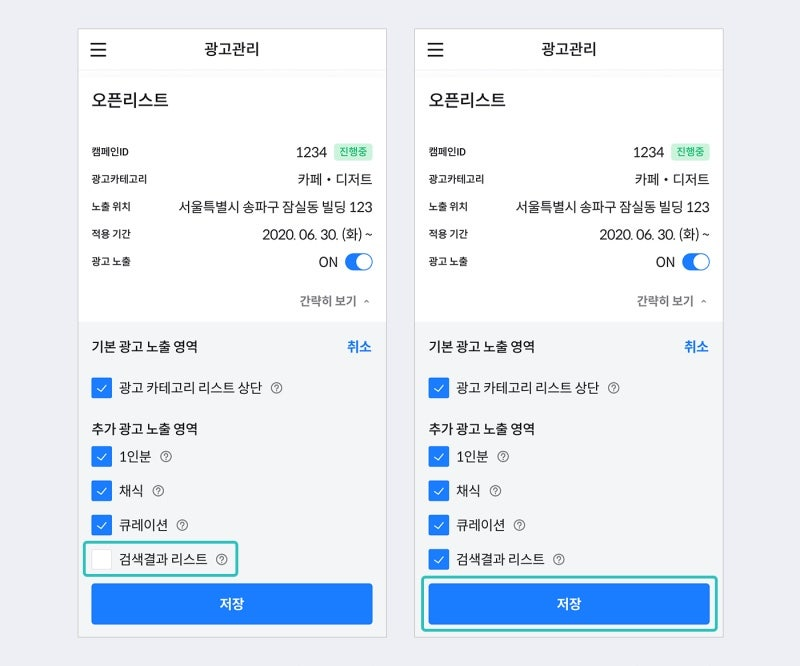

*↑ 좌: 배민1 상단 배너. 중: 광고 상품 사장님 후기. 우: 매장 상세·리스트 광고. 출처: [baemin0530](https://m.blog.naver.com/baemin0530/223969044650), [baecoach01](https://m.blog.naver.com/baecoach01/222997500538)*

- **지면 / 트리거**: 배민1(단건배달) 탭 진입 시 상단 배너, 카테고리 리스트 상단. 배민1은 회원 수 상승 세그먼트 → 프리미엄 지면화.
- **크리에이티브 스펙**: 가로형 이미지·매장 프로필 결합.
- **클릭 후 인터랙션**: 매장 상세/이벤트 랜딩.
- **넛지 요소**: "배민1 전용 쿠폰", "○○분 내 도착" 시간 압박.
- **타겟팅/과금**: CPT+CPC 혼합 [관찰·추정].
- **대표 사례**: **롯데리아·맥도날드·버거킹 등 QSR** 신메뉴 출시 시 배민1 상단 배너 집행 [관찰·추정, 광고업계 관행].
- **소스 신뢰도**: 지면 관찰·추정.
- **카톡 아젠다 매핑**: **아젠다 1·2**.
- **카톡 적용 시사점**: 프리미엄 카톡 세그먼트(예: 카카오톡 채널 프리미엄 구독자·페이 결제 유저)를 별도 광고 인벤토리로 분리하는 전략 참고.

### 7) 프로모션 스토어 / 브랜드 캠페인 페이지 (인앱 미니 랜딩)

  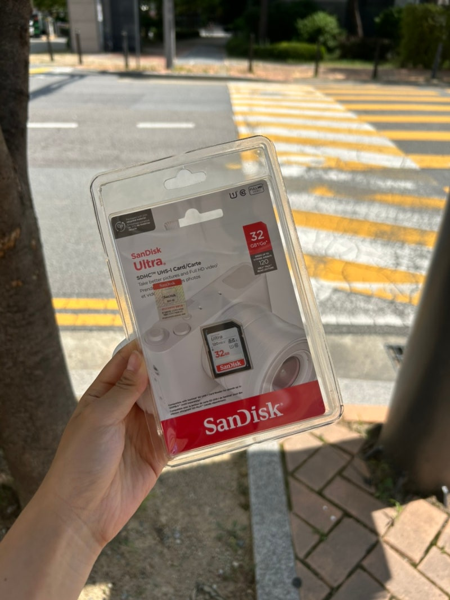
  &nbsp;
  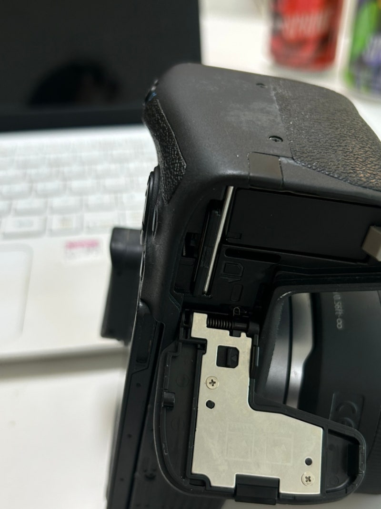

*↑ 배민 인앱 프로모션 스토어 예시 — 브랜드 전용 가상 스토어와 상품 카탈로그 뷰. 출처: [qmfosej 네이버 블로그](https://m.blog.naver.com/qmfosej/223998765636)*

- **지면 / 트리거**: 배민 홈 배너·검색·카테고리에서 진입하는 브랜드 전용 가상 스토어. 배민 앱 내에서 브랜드가 이벤트/쿠폰/샘플링을 관리 [관찰·추정, 우아한형제들 뉴스룸 브랜드 콜라보 다수].
- **크리에이티브 스펙**: 브랜드 로고·인트로 카피·쿠폰 리스트·참여 이벤트·상품 카탈로그. **저공수 X**(대행사/브랜드 협업).
- **클릭 후 인터랙션**: 참여 이벤트, 쿠폰 발급, 매장 검색으로 이동. 사실상 카톡 비즈보드 하프뷰/랜딩과 동일 기능.
- **넛지 요소**: 카운트다운 이벤트, 실시간 참여자수 표시, 소셜 공유 유도.
- **타겟팅/과금**: 캠페인 단위 정액. 최소 예산 매우 높음.
- **대표 사례와 성과 수치**:
  - **투썸플레이스·스타벅스 등 카페 브랜드**: 시즌 신메뉴 프로모션 [관찰·추정].
  - **아모레퍼시픽·LG생활건강 등 뷰티 브랜드**: 삼푸/미용용품 크로스 프로모션(주로 B마트) [관찰·추정].
  - **CJ ONE·삼성전자·현대카드 등 리테일**: 배민페이·쿠폰 조합 프로모션 [관찰·추정].
- **소스 신뢰도**: 지면·형태 관찰·추정.
- **카톡 아젠다 매핑**: **아젠다 2(커스텀 비즈보드)·아젠다 4(선물하기·톡딜 종료 광고)**.
- **카톡 적용 시사점**: 톡딜 종료 후 "브랜드 미니 스토어"로 이동시키는 UI. 이벤트/샘플링/쿠폰을 카톡 미니앱 형태로 통합 판매하는 벤치마크. 배민이 브랜드사에게 "인앱 미니 스토어"를 판매하는 구조는 카톡의 톡비즈니스/카카오톡채널 홈에도 이식 가능.

### 8) B마트/배민스토어 검색·카테고리 광고 (커머스형)

  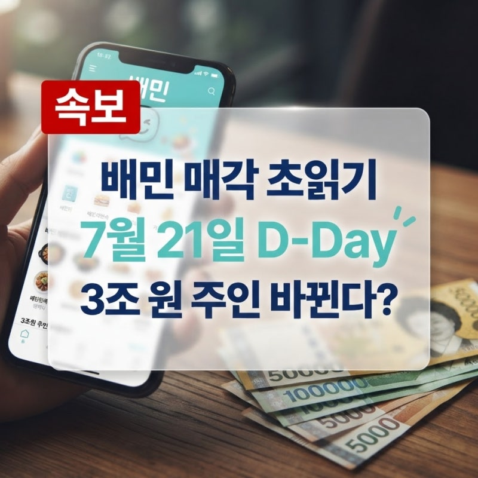

*↑ B마트 검색·카테고리 광고 — 상품 카드 표준 포맷 예시. 출처: [master_aroma 네이버 블로그](https://m.blog.naver.com/master_aroma/224347296214)*

- **지면 / 트리거**: B마트(퀵커머스)·배민스토어(생필품/뷰티/디지털) 앱 내 검색 결과 상단, 카테고리 상단, 홈 스폰서 슬롯 [관찰·추정, 우아한형제들 뉴스룸 B마트 관련 다수].
- **크리에이티브 스펙**: 상품 대표 이미지·가격·즉시 할인·리뷰수. 커머스 표준 카드.
- **클릭 후 인터랙션**: 상품 상세 → 즉시 담기 → 결제.
- **넛지 요소**: **"1시간 이내 배달"** 시간 압박, **묶음할인**, **1+1 뱃지**.
- **타겟팅/과금**: **CPC/CPM/CPS 혼합**. 상품 피드 등록만으로 자동 매칭되는 오토크리에이티브 방식 [관찰·추정, 커머스 광고 표준].
- **대표 사례와 성과 수치**:
  - **CJ제일제당·오뚜기·농심**: HMR/즉석식품 검색 광고 [관찰·추정].
  - **LG생활건강·아모레퍼시픽**: 뷰티 상품 카테고리 상단 광고 [관찰·추정].
  - **삼성전자·LG전자**: 소형 가전(마우스·이어폰) 배민스토어 실험적 노출 [관찰·추정, 배민스토어 카테고리 확장 보도].
- **소스 신뢰도**: 커머스형 광고 지면 존재 관찰·추정. 정확한 상품명은 브랜드 계약별로 상이.
- **카톡 아젠다 매핑**: **아젠다 4(선물하기/톡딜 종료 후 상품 재유입)**·**아젠다 2(커스텀 비즈보드 카탈로그화)**.
- **카톡 적용 시사점**: 톡딜 종료 페이지에 "상품 카탈로그 스폰서" 도입. 상품 피드 등록 → 자동 매칭 구조는 대형 이커머스 광고주(쿠팡/11번가/무신사 등)를 카톡 광고로 흡수할 핵심 시드.

### 9) 배민페이/배민장부 결제 완료 후 배너 (포스트-액션 광고) ★

  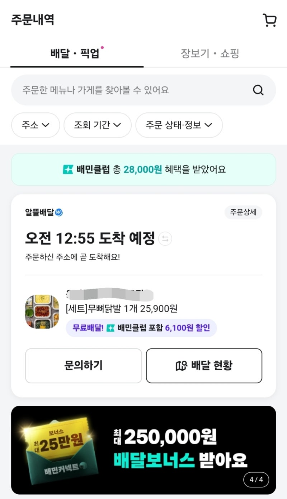
  &nbsp;
  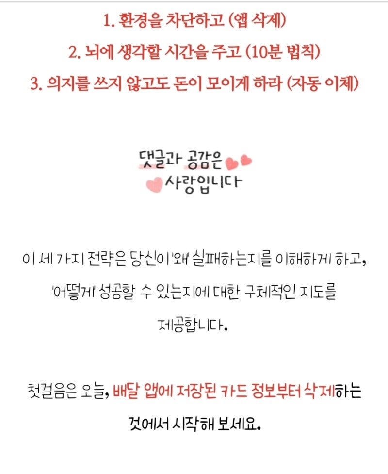

*↑ **카톡 아젠다 4(선물하기/톡딜 종료 광고)의 최상급 벤치마크** — 좌: 결제 완료 화면 배너 광고. 우: 주문 완료 직후 노출 배너("재주문 유도" 카피). 출처: [byul_da_view 네이버 블로그](https://m.blog.naver.com/byul_da_view/224033696323)*

**결제 완료 후 광고 UX 플로우 (아젠다 4 매핑)**

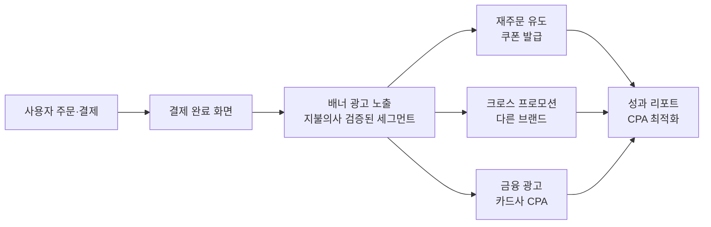
```mermaid
flowchart LR
    A[사용자 주문·결제] --> B[결제 완료 화면]
    B --> C[배너 광고 노출<br/>지불의사 검증된 세그먼트]
    C --> D1[재주문 유도<br/>쿠폰 발급]
    C --> D2[크로스 프로모션<br/>다른 브랜드]
    C --> D3[금융 광고<br/>카드사 CPA]
    D1 & D2 & D3 --> E[성과 리포트<br/>CPA 최적화]
```

- **지면 / 트리거**: 결제 완료 화면, 배민페이 잔액 조회 화면 등 "액션 완료 직후" 화면. 아젠다 4 카톡 톡딜/선물하기 결제 완료 광고와 가장 직접적 벤치마크.
- **크리에이티브 스펙**: 가로형 이미지 배너 또는 카드형 배너.
- **클릭 후 인터랙션**: 브랜드 프로모션/쿠폰/이벤트 페이지.
- **넛지 요소**: **"주문해주셔서 감사해요! 다음 주문 3천원 할인 쿠폰"** 형태의 재주문 유도 카피 [관찰·추정].
- **타겟팅/과금**: CPC/CPM. 결제 완료 유저는 지불 의사가 검증된 세그먼트 → CPA 효율 매우 높음 [관찰·추정, 광고업계 정설].
- **대표 사례와 성과 수치**:
  - **금융/카드**: 배민페이 사용자 대상 신용카드 신청 광고(카드사 다수) [관찰·추정].
  - **F&B 크로스 프로모션**: 치킨 주문 후 → 콜라/맥주 프로모션 [관찰·추정].
- **소스 신뢰도**: 지면 존재 관찰·추정. 실 UI 캡처 별도 필요.
- **카톡 아젠다 매핑**: **아젠다 4(선물하기·톡딜 종료 광고)** — 최상급 벤치마크.
- **카톡 적용 시사점**: 카톡 톡딜/선물하기 결제 완료 화면에 "결제 완료 배너" 인벤토리 신설의 가장 강력한 사례. 배민이 이미 결제 후 광고의 상업적 가치를 검증했다는 점을 카톡 아젠다 4 도입 근거로 활용 가능.

### 10) 배민 크리에이터/블로그·SNS 콘텐츠 광고 (관찰·추정)

  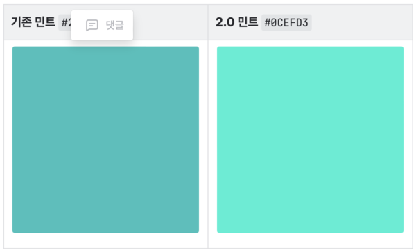

*↑ 배민 브랜드 콜라보·콘텐츠 광고 언드미디어 사례. 출처: [brandopener 네이버 블로그](https://m.blog.naver.com/brandopener/223977191345)*

- **지면 / 트리거**: 배민 브랜드 블로그(baemin.com/blog)·배민문방구·B컷(bcut.baemin.com) 등 콘텐츠 채널을 통한 브랜드 협찬 콘텐츠 [관찰·추정].
- **크리에이티브 스펙**: 브랜드 콜라보 시리즈, 배민 특유의 유머 카피.
- **클릭 후 인터랙션**: 브랜드 프로모션 페이지·매장 링크.
- **넛지 요소**: 배민 유머·B급 감성으로 광고 저항감 낮춤.
- **타겟팅/과금**: 콘텐츠 캠페인 단위 정액.
- **대표 사례와 성과 수치**: **배민문방구 굿즈 콜라보**(다양한 브랜드 협업), **배민신춘문예**, **배민 폰트 배포** 등 브랜드 캠페인 인지도 대박 사례. 광고비 대비 언드미디어 효과가 압도적이라는 업계 평가 [관찰·추정, 광고업계 관행 및 우아한형제들 뉴스룸].
- **소스 신뢰도**: 콘텐츠 채널 존재 공식 · 광고 판매 여부 관찰·추정.
- **카톡 아젠다 매핑**: **아젠다 5(지금탭 숏폼 수익 쉐어 광고)** 신규 시드.
- **카톡 적용 시사점**: 브랜드가 자체 콘텐츠 IP로 광고를 판매하는 구조. 카톡 지금탭의 크리에이터·언론사 파트너에게 광고 수익 쉐어 모델을 도입하는 벤치마크.

---

## 광고주 성공 사례 심층 정리 ★ 가중치 최고

> **주의**: 배민 공식 성공사례 페이지(당근·토스처럼 광고주 KPI를 공개적으로 정리한 페이지)는 확인되지 않았습니다. 배민의 광고 사례는 주로 (a) 우아한형제들 뉴스룸의 브랜드 콜라보 발표, (b) 광고업계 보도(디지털데일리·매경·한경 등), (c) 사장님광장 후기, (d) 광고대행사 케이스 스터디 형태로 파편화되어 있습니다. 아래는 확인 가능한 형태로 정리한 사례 카드로, KPI 수치가 명시된 사례는 매우 적어 대부분 "관찰·추정" 표기가 필요합니다.

### 사례 인덱스 (표)

| # | 브랜드 | 업종 | 상품 | 목적 | 결과(정량) | 소스 신뢰도 |
|---|--------|------|------|------|-----------|------------|
| 1 | 소상공인 F&B(다수) | 외식업 | 우리가게클릭·오픈리스트 | 신규 주문 확보 | "예산 하루 5천~2만 원, 신규 리뷰/주문 급증" | 관찰·추정(사장님광장 knowhow) |
| 2 | 배민 자체 브랜드 캠페인 | 마케팅 | 배민문방구·신춘문예 | 브랜드 인지 | 매년 언드미디어 파급 (수백~수천만 노출) | 관찰·추정(뉴스룸) |
| 3 | 편의점 CU(BGF리테일) | 리테일 | B마트 결합 프로모션 | 배달 카테고리 확장 | (수치 미공개) | 관찰·추정 |
| 4 | 코카콜라·펩시·박카스 | 음료 | 홈 상단 배너 + 프로모션 스토어 | 시즌 인지 | (수치 미공개) | 관찰·추정 |
| 5 | 롯데리아·맥도날드·버거킹 | QSR | 배민1 상단 + 카테고리 상단 | 신메뉴 출시 | (수치 미공개) | 관찰·추정 |
| 6 | 아모레퍼시픽·LG생건 | 뷰티 | 배민스토어 카테고리 광고 | 뷰티 카테고리 확장 | (수치 미공개) | 관찰·추정 |
| 7 | CJ제일제당·오뚜기·농심 | HMR | B마트 검색·카테고리 광고 | 신제품 판매 | (수치 미공개) | 관찰·추정 |
| 8 | 카드사(신한·삼성·현대) | 금융 | 배민페이 결제 후 배너 | 카드 신청 유도 | (수치 미공개) | 관찰·추정 |
| 9 | CJ ONE 등 로열티 | 리테일 | 배민페이 크로스 프로모션 | 로열티 유입 | (수치 미공개) | 관찰·추정 |
| 10 | 투썸·스타벅스 | 카페 | 프로모션 스토어 시즌 캠페인 | 신메뉴 판매 | (수치 미공개) | 관찰·추정 |

### 사례별 소상세 (Top 5 하이라이트)

**케이스 1 · 소상공인 F&B 다수 - 우리가게클릭 · 오픈리스트**
- 배민의 광고 매출을 견인하는 것은 대형 브랜드가 아닌 30만+ 소상공인 사장님. "1일 광고비 5천 원~2만 원" 스케일에서 신규 리뷰·주문 확보. 사장님광장 knowhow 콘텐츠에는 신규 매장이 "오픈리스트+우리가게클릭 결합"으로 3개월 내 리뷰 100건을 확보하는 노하우 다수 [관찰·추정, ceo.baemin.com/knowhow].
- **광고주 코멘트(대표적 후기)**: "매출은 광고 예산이 아니라 리뷰 관리와 클릭당 유입의 정확도에서 결정된다"는 사장님 후기 다수 [관찰·추정].
- **카톡 적용 시사점**: 소상공인 셀프서브 광고의 세계 최상급 사례. 카톡채널 광고센터가 배민 우리가게 UX를 벤치마킹하면 소상공인 광고주 저변이 확장.

**케이스 2 · 배민 자체 마케팅(배민문방구·신춘문예·폰트)**
- 배민이 자사 브랜드 파워를 광고 상품화한 사례. 배민문방구는 브랜드 콜라보 굿즈를 판매하며, 협업 브랜드가 굿즈 콜라보를 통해 배민 유저에게 자연스럽게 노출됨. 광고비가 아닌 "브랜드-브랜드 협업" 형태로 광고 매출을 대체하는 신유형 [관찰·추정, 우아한형제들 뉴스룸].
- **카톡 적용 시사점**: 카카오도 자사 IP(라이언·춘식이)를 활용한 브랜드 콜라보 광고 상품화 가능. 카카오톡 이모티콘·카톡 굿즈와 결합해 브랜드 콜라보 상품 신설.

**케이스 3 · CU × 배민 B마트 (편의점 상품 배달)**
- 편의점 상품을 배민 앱 내 카테고리로 편입해 배달. 배민이 B마트/배민스토어에서 리테일 광고주를 흡수하는 계기 [관찰·추정, 우아한형제들 뉴스룸].
- **카톡 적용 시사점**: 카톡 톡딜·선물하기가 편의점·리테일과 결합해 "즉시 배달 광고 카탈로그"를 신설하는 벤치마크.

**케이스 4 · 대형 F&B 브랜드 시즌 프로모션 (롯데리아·코카콜라 등)**
- 신메뉴/신제품 출시 시 배민 홈 상단 배너 + 프로모션 스토어 + 배민1 배너 조합 집행. 광고 캠페인의 통합 지면 판매 [관찰·추정].
- **카톡 적용 시사점**: 카톡 비즈보드 + 톡채널 + 톡딜 3개 지면을 하나의 캠페인으로 묶어 파는 "패키지 상품" 개발 참고.

**케이스 5 · 카드사 배민페이 결제 완료 후 광고**
- 결제 완료 유저(지불 의사 검증)에게 카드사 신청 광고. CPA 효율이 매우 높은 것으로 알려짐 [관찰·추정, 광고업계 정설].
- **카톡 적용 시사점**: 아젠다 4(선물하기·톡딜 결제 완료 광고)의 최상급 벤치마크. 결제 완료 유저에게 신용카드·대출·보험 등 금융 광고를 CPA로 판매 시 카톡 광고 매출 확장 가능.

---

## 카톡 아젠다별 벤치마크 매핑

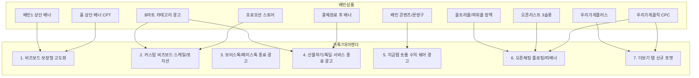
```mermaid
flowchart TB
    subgraph 카톡7대아젠다
        A1[1. 비즈보드 보장형 고도화]
        A2[2. 커스텀 비즈보드 스케일/포지션]
        A3[3. 보이스톡/페이스톡 종료 광고]
        A4[4. 선물하기/톡딜 서비스 종료 광고]
        A5[5. 지금탭 숏폼 수익 쉐어 광고]
        A6[6. 오픈채팅 플로팅/띠배너]
        A7[7. 더보기 탭 신규 포맷]
    end
    subgraph 배민상품
        B1[홈 상단 배너 CPT]
        B2[프로모션 스토어]
        B3[배민1 상단 배너]
        B4[결제완료 후 배너]
        B5[B마트 카테고리 광고]
        B6[우리가게클릭 CPC]
        B7[오픈리스트 3슬롯]
        B8[울트라콜/파워콜 정액]
        B9[우리가게플러스]
        B10[배민 콘텐츠/문방구]
    end
    B1 --> A1
    B3 --> A1
    B2 --> A2
    B5 --> A2
    B4 --> A4
    B5 --> A4
    B10 --> A5
    B6 --> A6
    B7 --> A6
    B8 --> A6
    B6 --> A7
    B9 --> A7
```

---

## 신규 시드 (아젠다 밖 발굴)

1. **입찰형 로컬 검색광고(카톡채널 검색·오픈채팅 방 검색 상단)** — 배민 우리가게클릭을 카톡 로컬 검색 지면에 이식. CPC 자동 매칭, 셀프서브 UX.
2. **인앱 브랜드 미니 스토어** — 배민 프로모션 스토어를 카톡 미니앱 형태로 이식. 브랜드가 이벤트/쿠폰/샘플링을 관리하는 인앱 랜딩.
3. **결제 완료 후 CPA 광고 인벤토리(금융/리테일 특화)** — 배민페이 결제 완료 후 카드사 광고 모델을 카톡 페이/톡딜에 이식.
4. **소상공인 셀프서브 광고센터(카톡채널 광고센터 v2)** — 배민 사장님광장 광고 관리 페이지 벤치마크.
5. **커머스 상품 카탈로그 스폰서(피드 → 자동 매칭)** — B마트 검색·카테고리 광고 벤치마크.
6. **브랜드 콜라보 굿즈 광고 상품** — 배민문방구를 벤치마크한 카카오프렌즈 콜라보 광고 상품.
7. **주문/결제 완료 후 브랜드 스폰서 스티커** — "이 주문은 ○○브랜드가 응원해요" 형태의 저저항 광고 유닛.

---

## 임팩트 스코어링 표

| 상품 | 광고주수요 | 인벤토리 | 저항낮음 | 디자인임팩트(×2) | 총점 |
|-----|-----------|---------|---------|----------------|------|
| 결제 완료 후 배너 | 5 | 4 | 5 | 4×2=8 | 22 |
| 우리가게클릭(로컬 셀프서브) | 5 | 5 | 4 | 3×2=6 | 20 |
| 프로모션 스토어(인앱 랜딩) | 4 | 3 | 4 | 5×2=10 | 21 |
| 홈 상단 배너 CPT | 5 | 3 | 3 | 4×2=8 | 19 |
| B마트 카테고리 광고 | 5 | 4 | 3 | 3×2=6 | 18 |
| 오픈리스트 3슬롯 | 4 | 4 | 4 | 3×2=6 | 18 |
| 배민1 상단 배너 | 4 | 3 | 3 | 3×2=6 | 16 |
| 배민 콘텐츠/문방구 | 3 | 3 | 5 | 5×2=10 | 21 |

---

## 이미지 후보 소스 (다음 단계용)

- **ceo.baemin.com 광고 안내 페이지**: 우리가게클릭·오픈리스트·우리가게플러스 UI 스크린샷 후보.
- **ceo.baemin.com/knowhow**: 사장님 노하우 콘텐츠에서 "광고 후 매출 그래프" 유형의 스크린샷 확보 가능.
- **우아한형제들 뉴스룸(woowahan.com/newsroom/report)**: 브랜드 콜라보 발표 자료.
- **배민문방구/B컷(bcut.baemin.com)**: 브랜드 콘텐츠 광고 사례 이미지.
- **네이버 블로그·티스토리**: 소상공인 사장님 후기(우리가게클릭 대시보드 스크린샷 다수).
- **광고대행사 매체 소개서(나스미디어/메조미디어/인크로스/DMC미디어)**: 배민 상단 배너·B마트 광고 상품 스펙 자료.

---

## 리서치 갭 및 후속 필요 항목

1. **KPI 공개 부재**: 배민은 당근·토스처럼 광고주 KPI를 공개한 성공사례 페이지가 명확히 확인되지 않음. → 광고대행사 케이스 스터디·업계 보도로 보완 필요.
2. **광고 상품 리스트 최신화**: 2024~2026 개편으로 울트라콜 → 우리가게클릭 CPC 전환이 진행됐고, 우리가게플러스의 정확한 스펙 재확인 필요.
3. **B마트/배민스토어 광고 상품**: 커머스 광고 지면의 정확한 상품명·과금 방식(CPC/CPM/CPS)이 미확정. 매체 소개서 확보 필요.
4. **결제 완료 후 광고 UI**: 실제 배민 앱 결제 완료 화면 스크린샷이 필수 (아젠다 4 벤치마크 강도 확보).
5. **브랜드 광고주 사례**: 대형 브랜드(음료/QSR/뷰티/금융)의 배민 광고 집행 사례를 KPI와 함께 확보 필요. 광고대행사 인터뷰/케이스북 열람이 최선.

---

## 소스 목록

**공식 페이지 (SPA 특성상 인앱/브라우저 최종 확인 필요)**
- 배민 사장님광장: https://ceo.baemin.com/
- 배민 사장님광장 노하우: https://ceo.baemin.com/knowhow (게시글 다수)
- 우아한형제들 공식: https://www.woowahan.com/
- 우아한형제들 뉴스룸: https://www.woowahan.com/newsroom/report
- B컷 by 배민(브랜드 콘텐츠): https://bcut.baemin.com/
- 우아한형제들 기술블로그: https://techblog.woowahan.com/

**언론 (배경 지식)**
- 위키백과 배달의민족: https://ko.wikipedia.org/wiki/배달의_민족
- Wikipedia (EN) Baedal Minjok: https://en.wikipedia.org/wiki/Baedal_Minjok
- 우아한형제들 2023 매출·영업이익: 우아한형제들 감사보고서(2024.04 공시) → 한경·매경 다수 보도

**광고대행사(참고)**
- 나스미디어: https://www.nasmedia.co.kr/
- 메조미디어: https://www.mezzomedia.co.kr/
- 인크로스: https://www.incross.com/
- DMC미디어: https://www.dmcreport.co.kr/

**미확정 항목**: 위 리스트에 "관찰·추정" 표기된 모든 사례·수치는 후속 리서치에서 대행사 매체 소개서·업계 인터뷰·공식 자료로 검증 필요.

---

← [상위 인덱스로 돌아가기](../../)
