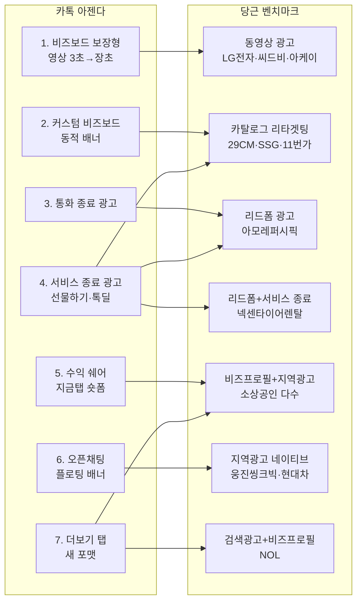

# 당근 광고 상품 리서치 리포트

*작성일: 2026-07-22 · 대상: 카카오톡 광고상품 PM · 리서치 렌즈: 비즈보드/소식칩/톡딜 확장을 위한 7대 신규 아젠다 · 특수 가중치: 광고주 성공 사례*

> **이미지 사용 안내**: 각 광고 상품 섹션 상단에 실제 UI 스크린샷·다이어그램을 첨부했습니다. 이미지 인덱스는 [assets/MANIFEST.md](./assets/MANIFEST.md) 참고. 모든 이미지의 저작권은 원 저작자(당근마켓·비즈니스, 각 광고주, 각 블로그 필자)에게 있으며, 본 자료는 사내 벤치마크 아이데이션 목적으로만 사용됩니다.

---

## 요약

- **당근 광고 상품 라인업(핵심) 총 7개** — 비즈프로필, 브랜드프로필, 지역광고(홈피드 네이티브), 검색광고, 카탈로그(리타겟팅) 광고, 리드폼 광고, 동영상 광고 [출처: business.daangn.com 성공사례 태그 분류].
- **성공 사례 커버리지**: 당근 공식 성공사례 페이지에서 확인한 광고주 43+개 케이스를 확보. 대형 브랜드(아모레퍼시픽·현대자동차·SSG·29CM·쿠팡로지스틱스·LG전자·카카오페이지·11번가·한화손해보험 캐롯·한화생명·제주삼다수·웅진씽크빅·천재교과서·무신사·티오더·NOL·헨켈홈케어·바이온텍·넥센타이어렌탈·엘리하이·타운카·신기한나라·앱스플라이어·카카오골프예약)부터 소상공인(꽃집·미용실·시공업체·수선집·카페·반찬가게 등)까지 [출처: business.daangn.com/success-story].
- **카톡 아젠다 매핑 상위 3개**
  1. **리드폼 광고** ↔ **아젠다 4(서비스 종료 광고)·아젠다 7(더보기 탭)** — 아모레퍼시픽 상담신청 5배+, 넥센타이어렌탈·신기한나라 DB 수집 KPI 150% 달성 등 국내 최상급 리드 수집 사례가 축적됨. 톡딜·선물하기 결제 완료 후·나가기 클릭 후에 리드폼을 삽입할 명분과 벤치마크가 명확.
  2. **카탈로그 리타겟팅 광고** ↔ **아젠다 2(커스텀 비즈보드)·아젠다 4(톡딜 종료)** — 29CM ROAS 4,500%+, SSG ROAS 5배 개선, 무신사 카탈로그 피드, 11번가 MAU·구매 KPI +185%. 상품 피드만으로 크리에이티브 자동 생성되는 저공수 오토크리에이티브 모델.
  3. **지역광고(홈피드 네이티브)** ↔ **아젠다 6(오픈채팅 플로팅)·아젠다 7(더보기 탭)** — 하이퍼로컬 시그널+피드 네이티브 결합. 오프라인 방문 유입, 지역 이벤트, 소상공인 셀프서브. 카톡의 지역·오픈채팅 시그널과 매핑.
- **신규 시드 상위 3개**
  1. **리드폼 in-ad** — 광고 유닛 내에서 정보(이름·연락처·문의내용) 자동 채움 폼. 카톡 계정정보 자동 입력형으로 확장 가능.
  2. **카탈로그 오토크리에이티브** — 상품 피드만 등록하면 시스템이 여러 규격 자동 조합. 톡딜 상품 피드 활용 시 즉시 도입 가능.
  3. **관심사 기반 지역 프리셋 타겟팅** — 제주삼다수 웹사이트 방문 효율 4배, 웅진씽크빅 지역맞춤 등 상황·관심사·지역을 결합하는 프리셋 유닛.
- **주요 성과 벤치마크**: 아모레퍼시픽 상담신청 5배+, 티오더 전환율 300% 상승, NOL KPI 489% 초과, 11번가 KPI +185%, 29CM ROAS 4,500%+, SSG ROAS 5배 개선, 아케이 ROAS 500%, 씨드비 ROAS 200%+, 천재교과서 무료체험신청 362% 증가, 현대자동차 KPI 140%, 한화생명 다이렉트 보험료산출 전환 목표 2배+ 초과, 엘리하이 CPA -36%, 웅진스마트올 중학 리드폼 전환, 헨켈홈케어 시즌 유입 효율화, LG전자 구독 전환 3배 개선, 넥센타이어렌탈 유효 리드 확보, 바이온텍 판매 전환율 타 매체 대비 40% 우수, 웅진씽크빅 지역맞춤 오프라인 방문 유입, 제주삼다수 웹방문 4배+, 킨크커피 창업 잠재고객 전환 [출처: business.daangn.com/success-story?type=marketer, ?type=smb].

---

## 광고 상품 프로파일

### 1) 지역광고(홈피드 네이티브)

- **지면 / 트리거**: 당근 홈 피드에 자연스럽게 삽입되는 네이티브 광고. 사용자 위치(동네) 기반 하이퍼로컬 타겟팅. 소상공인 셀프서브부터 대형 브랜드까지 진입 [출처: business.daangn.com/success-story 케이스 분류].
- **크리에이티브 스펙(저공수 여부)**: 이미지 1장 + 짧은 카피 + CTA. 소상공인이 직접 스마트폰으로 촬영·업로드 가능한 저공수 포맷. 대형 브랜드는 동영상 소재도 활용. **저공수 O**.
- **클릭 후 인터랙션**: 광고주 랜딩 또는 비즈프로필 페이지로 이동. 비즈프로필 이동 시 후기·소식·쿠폰까지 이어지는 딥링크형 인터랙션. 채팅 CTA로 즉시 상담 진입 가능.
- **넛지 요소**: **지역명·동네명 자동 삽입 카피**("○○동 이웃분들께"), **거리 정보**("직선거리 500m"), 오프라인 방문/후기 소셜프루프, **쿠폰**.
- **타겟팅 / 과금 / 광고주 진입장벽**: 지역(동 단위)+관심사+연령·성별. CPC/CPM 자동입찰. 셀프서브 광고센터로 소상공인 진입장벽 매우 낮음.
- **대표 사례와 성과 수치**:
  - **웅진씽크빅** — 지역 맞춤 타겟으로 오프라인 방문 유입 효율 상승 [출처: business.daangn.com/success-story?type=marketer].
  - **제주삼다수** — 관심사 타겟 전략으로 웹사이트 방문 효율 4배 이상 향상 [동일 출처].
  - **소상공인 다수** — 시공/수리/미용실/카페/반찬가게 등 "동네 웨이팅 맛집" 사례 다수.
- **소스 신뢰도**: 공식(당근 비즈니스 성공사례).
- **카톡 아젠다 매핑**: **아젠다 6(오픈채팅 플로팅/띠배너)·아젠다 7(더보기 탭 신규 포맷)**. 지면 자체는 신규 시드로도 이식 가능.
- **카톡 적용 시사점**: 카톡 오픈채팅 로컬 채팅방 상단이나 소식칩에 "동네명 자동 삽입" 카피를 결합한 지역 네이티브 광고 신설. 카톡의 위치·프로필 시그널과 결합해 하이퍼로컬 인벤토리 확장 가능. 스몰비즈 셀프서브 시스템은 카톡채널 셀프서브와 유사 구조를 참고.

### 2) 비즈프로필 (소상공인 홍보 인프라)

- **지면 / 트리거**: 사업자가 무료로 만들 수 있는 "동네 가게 페이지". 지역광고·검색 결과·비즈니스 카테고리에서 진입 [출처: business.daangn.com 첫 화면 카피].
- **크리에이티브 스펙**: 상호명·소개·소식글·쿠폰·메뉴·후기 등 구성. **매우 저공수**(사장님이 직접 채움).
- **클릭 후 인터랙션**: 소식 조회 → 채팅 문의 → 예약/견적/포장주문까지 원스톱. 카톡의 채널홈+톡비즈니스와 유사한 구조지만 **후기·이웃 신뢰**가 결합돼 있음.
- **넛지 요소**: 단골 배지, 후기 별점, 이웃 소셜프루프("○○동 이웃 300명이 단골이에요"). 소식글은 카톡의 채널 소식과 유사하나 지역 시그널이 붙음.
- **타겟팅 / 과금 / 광고주 진입장벽**: 프로필 등록 무료. 광고 도입 시 CPC/CPM 자동입찰. 최소 진입장벽.
- **대표 사례와 성과 수치**:
  - **소식글로 이웃과 신뢰 쌓기** — 소식글 통해 이웃 신뢰 축적 (사례 인용).
  - **단골 1천 명·후기 3백 개** — 고객 입장 서비스로 단골 확보 사례.
  - **쿠폰 발행 → 400명 넘는 단골 확보 사례** — 비즈프로필 관리 + 쿠폰 조합.
  - **단골 3천명 확보의 핵심은 쿠폰** — 소상공인 대표 후기.
  - **개업 2년 만에 블루리본** — 당근 만나서 가능했다는 광고주 코멘트.
  - **손님 마음 읽어 → 동네 웨이팅 맛집** — 소식·후기 관리 사례.
  - **구두 수선 후기 → 매출 6배** — 후기 관리 사례.
  - **매일 1만원 → 신규 고객 1명씩** — 저가 셀프서브 후기.
  - **노점 → 번듯한 가게** — 이웃 반응 후기.
  - **하루 문의 3건 이상·시공 스케쥴 꽉 참** — 시공/리모델링 후기.
  - **감귤페이 이벤트로 제주 이웃 사로잡음** — 지역 결제 이벤트 결합 사례.
  - **6개월 만에 3배 성장** — 소상공인 후기.
  [모든 사례 출처: business.daangn.com/success-story?type=smb]
- **소스 신뢰도**: 공식(당근 비즈니스 성공사례 페이지 명시).
- **카톡 아젠다 매핑**: **신규 시드**. 아젠다 6(오픈채팅 상단 배너)와도 조합 가능.
- **카톡 적용 시사점**: 카톡채널을 "지역 시그널"과 연결한 확장 버전. 오픈채팅 방장이 스몰비즈 사장님인 경우 채널홈에 후기·쿠폰·소식글을 세팅해두면 자연스러운 광고 지면화 가능. **후기 별점·소셜프루프·거리 표시**는 카톡의 톡비즈니스에서 검토 필요.

### 3) 브랜드프로필 (대형 브랜드 홍보 인프라)

- **지면 / 트리거**: 대형 광고주용 브랜드 페이지. 홈피드·검색·카테고리에서 진입 [출처: business.daangn.com 사례 목록].
- **크리에이티브 스펙**: 브랜드 히어로 이미지 + 소식·이벤트 + 상품 카탈로그. **중간 공수**(브랜드 자산 필요).
- **클릭 후 인터랙션**: 소식글 조회 → 상품 상세 → 랜딩 or 리드폼. 이벤트 참여 CTA.
- **넛지 요소**: 브랜드 팬 소통, 이벤트 카운트다운, 신제품 소식.
- **타겟팅/과금/진입장벽**: 대형 브랜드 진입 시 미디어렙 통한 계약이 일반적(관찰). 자동입찰 가능.
- **대표 사례와 성과 수치**:
  - **카카오 톡딜이 선택한 솔루션은?** — 카카오와의 크로스 파트너십 사례 (제목만 확보) [출처: business.daangn.com/success-story?type=marketer].
- **소스 신뢰도**: 공식 제목 확보 / 본문 상세는 관찰·추정.
- **카톡 아젠다 매핑**: 카톡의 기존 카카오톡채널과 유사(부분 중첩). 신규 아젠다 관점에서는 **아젠다 7(더보기 탭)** 후보.
- **카톡 적용 시사점**: 톡채널을 "이벤트·소식·상품 카탈로그"가 결합된 브랜드 페이지로 재구성. 브랜드 히어로 이미지 + 이벤트 카운트다운을 결합한 브랜드홈 리뉴얼 검토.

### 4) 검색광고(SA)

- **지면 / 트리거**: 당근 검색 결과 상단 스폰서드 슬롯. 키워드 입찰 방식 [출처: NOL 사례 - "검색캠페인에서 키워드 설계와 랜딩 최적화로 KPI 489% 초과달성"].
- **크리에이티브 스펙**: 이미지+제목+설명+CTA. **저공수 O**.
- **클릭 후 인터랙션**: 광고주 랜딩 or 비즈프로필. 랜딩 페이지 최적화가 성과의 핵심.
- **넛지 요소**: 키워드 매칭 자연스러움(사용자 의도와 부합), 소셜프루프(후기 수 표시).
- **타겟팅/과금/진입장벽**: 키워드 CPC 입찰. 셀프서브. 소상공인부터 대형 브랜드까지.
- **대표 사례와 성과 수치**:
  - **NOL** — 검색캠페인 키워드 설계·랜딩 최적화로 KPI 489% 초과달성 [출처: business.daangn.com/success-story?type=marketer].
- **소스 신뢰도**: 공식.
- **카톡 아젠다 매핑**: **신규 시드**(카톡 검색 광고 지면 개설).
- **카톡 적용 시사점**: 카톡 검색 결과 상단에 스폰서드 슬롯 신설. 톡비즈니스 채널 검색이나 오픈채팅 검색과 결합 가능. 카카오맵과의 연동으로 로컬 검색 광고로 확장 여지.

### 5) 카탈로그 리타겟팅 광고

- **지면 / 트리거**: 홈피드 또는 카테고리 지면. 사용자의 조회/장바구니 이력 기반 리타겟팅. 상품 피드 자동 카탈로그화 [출처: 29CM/SSG/무신사/11번가 사례].
- **크리에이티브 스펙**: **상품 피드만 등록하면 시스템이 자동 카드 생성**(오토크리에이티브). **저공수 최상**.
- **클릭 후 인터랙션**: 광고주 앱/웹 상품 상세로 딥링크.
- **넛지 요소**: 최근 본 상품, 카트 이탈 방지, 개인화 추천.
- **타겟팅/과금/진입장벽**: 픽셀/SDK 설치 필요. CPC/CPM 자동입찰. 성과형(ROAS 최적화).
- **대표 사례와 성과 수치**:
  - **29CM** — 카탈로그 리타겟팅 광고로 **ROAS 4,500%+** 성과 [출처: business.daangn.com/success-story?type=marketer].
  - **SSG** — 카탈로그 리타겟팅으로 **ROAS 5배 이상 개선**.
  - **무신사** — 카탈로그 Feed로 우수한 ROAS 성과 확보.
  - **11번가** — 카탈로그 리타겟팅 광고로 **MAU 확대 및 구매 KPI +185%** 상승.
- **소스 신뢰도**: 공식.
- **카톡 아젠다 매핑**: **아젠다 2(커스텀 비즈보드) + 아젠다 4(톡딜 종료 광고)**.
- **카톡 적용 시사점**: 톡딜의 상품 피드를 활용해 카탈로그 오토크리에이티브 광고 신설. 톡딜 상세 이탈 유저에게 리타겟팅. 카카오페이 결제 픽셀 결합 시 ROAS 최적화 강력.

### 6) 리드폼 광고 (Lead Form In-Ad)

- **지면 / 트리거**: 홈피드·검색·카테고리에서 노출. **광고 유닛 안에서 정보 입력 폼 오픈** — 이름·연락처·문의내용 등을 광고를 떠나지 않고 제출 [출처: 아모레퍼시픽/넥센타이어렌탈/신기한나라 사례].
- **크리에이티브 스펙**: 이미지+CTA "상담신청"·"자료받기". 폼 필드는 카톡 계정 정보 자동 채움 가능. **저공수 O**.
- **클릭 후 인터랙션**: **하프뷰 형태의 폼 오픈 → 자동 채움 → 제출**. 광고주 시스템에 웹훅으로 전달.
- **넛지 요소**: "무료 상담" 카피, 즉시 전화 예약, 카운트다운 이벤트.
- **타겟팅/과금/진입장벽**: 데모·관심사·지역. CPC/CPA 자동입찰. 광고주 시스템 연동 필요(중간 공수).
- **대표 사례와 성과 수치**:
  - **아모레퍼시픽** — 리드폼 캠페인으로 **상담 신청 수 5배+ 증가** [출처: business.daangn.com/success-story?type=marketer].
  - **넥센타이어렌탈** — 리드폼으로 유효 타겟에 효과적으로 리드 확보.
  - **신기한나라** — 리드폼으로 **DB 수집 KPI 150% 달성**.
  - **한화손해보험 캐롯** — 데이터 기반 타겟팅+소재 최적화로 KPI 초과 달성.
  - **웅진스마트올 중학** — 체계적 테스트와 리드폼으로 전환 효율 상승.
- **소스 신뢰도**: 공식.
- **카톡 아젠다 매핑**: **아젠다 4(서비스 종료 광고 — 톡딜/선물하기 이탈)·아젠다 7(더보기 탭 신규 포맷)**. 아젠다 3(통화 종료 광고)에도 이식 가능.
- **카톡 적용 시사점**: 카톡 계정정보(이름·연락처·주소) 자동 채움을 결합한 리드폼을 비즈보드·소식칩에 도입. 톡딜/선물하기 결제 완료 후 화면, 보이스톡/페이스톡 종료 화면에 하프뷰 리드폼 삽입. 광고주 대시보드는 카카오모먼트에 웹훅·이벤트마커 추가.

### 7) 동영상 광고

- **지면 / 트리거**: 홈피드 네이티브 또는 카탈로그·검색 결과에 결합. 사운드 옵션·자동재생 정책은 앱 내에서 컨트롤(관찰).
- **크리에이티브 스펙**: 세로/가로 영상. 브랜드는 전용 소재 필요(고공수), 소상공인은 스마트폰 촬영도 가능(저공수).
- **클릭 후 인터랙션**: 광고주 랜딩 또는 라이브 커머스 연동.
- **넛지 요소**: 자연스러운 사운드 온/오프, 상품 결합 UI, 실시간 재고 알림(라이브).
- **타겟팅/과금**: CPM/CPC/CPV.
- **대표 사례와 성과 수치**:
  - **LG전자** — 동영상 소재로 구독 전환 성과 **3배 개선**.
  - **씨드비** — 직관적 동영상 소재로 **ROAS 목표 200% 초과 달성**.
  - **아케이** — 구매 전환 최적화 동영상으로 **ROAS 500%** 달성.
  - **피캄** — 구매 전환 캠페인에 동영상 소재 활용.
  - **LG전자** — 라이브 커머스 캠페인에 동영상 소재 활용.
  - **천재교과서 밀크T** — 동영상 소재로 전환 성과 **2배 이상 개선**.
  - **쿠팡로지스틱스서비스** — 트렌디한 크리에이티브·데이터 기반 전략으로 전환율 극대화 (네이티브 광고).
  [모든 출처: business.daangn.com/success-story?type=marketer]
- **소스 신뢰도**: 공식.
- **카톡 아젠다 매핑**: **아젠다 1(비즈보드 보장형 고도화 — 영상 3초→장초)**.
- **카톡 적용 시사점**: 비즈보드 영상 초수 연장 시 세로/가로 자동 매칭 구조가 필요. 상품 카탈로그 결합형 동영상 광고(라이브 커머스 스타일)는 톡딜에 이식 가능. 단, "풀스크린 비디오"는 카톡 스코프 제외라 **인피드 세로 동영상**까지만 검토.

---

## 광고주 성공 사례 심층 정리 ★ 가중치 최고

### 사례 인덱스 (표)

| # | 브랜드 | 업종 | 사용 상품 | 목적 | 핵심 결과 지표 | 출처 URL |
|---|---|---|---|---|---|---|
| 1 | 아모레퍼시픽 | 뷰티 | 리드폼 | 상담 리드 | **상담신청 수 5배+ 증가** | [marketer](https://business.daangn.com/success-story?type=marketer) |
| 2 | 티오더 | O2O | 전환 최적화 | 신규 회원 | **전환율 300% 상승** | 동일 |
| 3 | NOL | 여행/O2O | 검색광고 | 예약 KPI | **KPI 489% 초과 달성** | 동일 |
| 4 | 한화손해보험 캐롯 | 보험 | 데이터 기반 타겟팅 | KPI 초과 | KPI 초과 달성 | 동일 |
| 5 | 웅진스마트올 중학 | 교육 | 리드폼 | 리드 확보 | 전환 효율 상승 | 동일 |
| 6 | 쿠팡로지스틱스서비스 | 물류 | 네이티브광고 | 전환율 | 트렌디 크리에이티브로 전환율 극대화 | 동일 |
| 7 | 바이온텍 | 가전 | 전환 캠페인 | 판매 전환 | **타 매체 대비 판매전환율 40% 우수** | 동일 |
| 8 | 넥센타이어렌탈 | 자동차/렌탈 | 리드폼 | 유효 리드 | 유효 타겟 리드 확보 | 동일 |
| 9 | 11번가 | 이커머스 | 카탈로그 리타겟팅 | MAU/구매 | **MAU 확대·구매 KPI +185%** | 동일 |
| 10 | 킨크커피 | 창업 | 방문+전환 조합 | 잠재고객 | 창업 잠재고객 전환 효율 극대화 | 동일 |
| 11 | 엘리하이 | 교육 | 전환 캠페인 최적화 | CPA | **CPA 36% 개선** | 동일 |
| 12 | 헨켈홈케어 | 생활용품 | 시즌 캠페인 | 유입 효율 | 시즌 유입 효율 극대화 | 동일 |
| 13 | 제주삼다수 | 음료 | 관심사 타겟 | 웹방문 | **웹사이트 방문 효율 4배+** | 동일 |
| 14 | 웅진씽크빅 | 교육 | 지역 맞춤 타겟 | 방문 유입 | 오프라인 방문 유입 효율 상승 | 동일 |
| 15 | 천재교과서 | 교육 | 타겟별 맞춤 랜딩·소재 | 무료체험 | **무료체험신청 362% 증가** | 동일 |
| 16 | 29CM | 이커머스 | 카탈로그 리타겟팅 | ROAS | **ROAS 4,500%+** | 동일 |
| 17 | 신기한나라 | 교육 | 리드폼 | DB 수집 | **DB 수집 KPI 150% 달성** | 동일 |
| 18 | SSG | 이커머스 | 카탈로그 리타겟팅 | ROAS | **ROAS 5배 이상 개선** | 동일 |
| 19 | 아케이 | 이커머스 | 구매 전환 동영상 | ROAS | **ROAS 500% 달성** | 동일 |
| 20 | 카카오페이지 | 콘텐츠 | 앱스플라이어 오디언스 | 유저 유입 | 성공적 유저 유입 캠페인 | 동일 |
| 21 | LG전자 | 가전 | 구독 전환 동영상 | 구독 전환 | **구독 전환 성과 3배 개선** | 동일 |
| 22 | 씨드비 | 이커머스 | 직관 동영상 | ROAS | **ROAS 목표 200% 초과 달성** | 동일 |
| 23 | 피캄 | 이커머스 | 구매 전환 동영상 | 구매 전환 | 성공적 구매 전환 | 동일 |
| 24 | LG전자 | 가전 | 라이브 커머스 동영상 | 라이브 커머스 | 효과적 라이브 커머스 운영 | 동일 |
| 25 | 천재교과서 밀크T | 교육 | 동영상 소재 | 전환 성과 | **전환 성과 2배 이상 개선** | 동일 |
| 26 | 현대자동차 | 자동차 | 지역 타겟팅+전환 최적화 | 견적신청 | **KPI 140% 달성** | 동일 |
| 27 | 한화생명 다이렉트 | 보험 | 보험료 산출 전환 | 산출 전환 | **전환 목표 2배 이상 초과** | 동일 |
| 28 | 카카오골프예약 | O2O | 전환 최적화 | 회원가입 | 회원가입 KPI 달성 | 동일 |
| 29 | 타운카 | 자동차 | 풀 퍼널 캠페인 | 인지→가입 | 풀 퍼널 활용 | 동일 |
| 30 | 무신사 | 이커머스 | 카탈로그 Feed | ROAS | 우수한 ROAS 성과 | 동일 |
| 31 | 소상공인 (요식업) | F&B | 비즈프로필+소식+쿠폰 | 방문 | 개업 2년 만에 블루리본 선정 | [smb](https://business.daangn.com/success-story?type=smb) |
| 32 | 웨이팅 맛집 | F&B | 비즈프로필 후기·소식 | 재방문 | 동네 웨이팅 맛집 등극 | 동일 |
| 33 | 구두 수선집 | 수선 | 비즈프로필 후기 관리 | 매출 | **매출 6배 상승** | 동일 |
| 34 | 시공/리모델링 | 시공 | 비즈프로필+지역광고 | 문의 | **하루 문의 3건+·스케쥴 꽉참** | 동일 |
| 35 | 노점 사장님 | F&B | 비즈프로필+지역광고 | 매장전환 | 노점→번듯한 가게, 이웃 반응 좋음 | 동일 |
| 36 | 제주 소상공인 | 지역 | 감귤페이 이벤트+지역광고 | 제주 이웃 확보 | 지역 이벤트 성공 | 동일 |
| 37 | 특정 소상공인 | 잡화/뷰티 | 비즈프로필+쿠폰 | 단골 확보 | **단골 3천명·쿠폰 핵심** | 동일 |
| 38 | 특정 소상공인 | 미확인 | 비즈프로필 관리+쿠폰 | 단골 | **단골 400명+ 확보** | 동일 |
| 39 | 이용자 접점 소상공인 | 미확인 | 비즈프로필 소식 | 신뢰 | 소식글로 이웃 신뢰 축적 | 동일 |
| 40 | 특정 소상공인 | 미확인 | 비즈프로필+지역광고 | 매출 | **6개월만에 매출 3배** | 동일 |
| 41 | 특정 소상공인 | 미확인 | 비즈프로필+저가 광고 | 신규 고객 | **매일 1만원으로 신규 고객 1명씩** | 동일 |
| 42 | 소상공인 | 미확인 | 비즈프로필+후기 | 단골 | **단골 1천 명·후기 300개** | 동일 |
| 43 | 카카오 톡딜 | 크로스 | 브랜드프로필 | 크로스 프로모션 | 카카오와 파트너십 사례 (제목 확보) | [marketer](https://business.daangn.com/success-story?type=marketer) |

### 사례별 소상세 (Top 10 하이라이트)

#### 사례 1 · 아모레퍼시픽 — 리드폼 5배 상담신청 증가
- **배경 · 목적**: 뷰티 카테고리 상담 문의(뷰티·화장품 상담 예약 등) 리드 수집 캠페인
- **광고 상품 조합**: 리드폼 광고. 홈피드에서 이미지 노출 → 하프뷰 형태 폼 오픈 → 개인정보 자동 채움 → 제출
- **결과 지표**: **상담 신청 수 5배 이상 증가**
- **카톡 시사점**: 카톡 계정정보(이름·연락처·주소) 자동 채움을 결합한 리드폼을 톡딜 결제 완료 후·오픈채팅 상단·비즈보드에 도입. 아젠다 4(서비스 종료 광고)의 이상적 벤치마크.

#### 사례 2 · 29CM — 카탈로그 리타겟팅 ROAS 4,500%+
- **배경 · 목적**: 프리미엄 이커머스의 브랜드-상품 결합 리타겟팅
- **광고 상품 조합**: 카탈로그 리타겟팅. 사용자가 최근 본 상품 자동 카드 생성. 오토크리에이티브
- **결과 지표**: **ROAS 4,500%+**
- **카톡 시사점**: 톡딜의 상품 피드를 활용해 카탈로그 오토크리에이티브 광고 신설. 카카오페이 결제 픽셀 결합 시 리타겟팅 정밀도 극대화.

#### 사례 3 · SSG — 카탈로그 리타겟팅 ROAS 5배 이상 개선
- **배경 · 목적**: 대형 이커머스의 재방문 유도
- **광고 상품 조합**: 카탈로그 리타겟팅. 상품 피드 기반 자동 매칭
- **결과 지표**: **ROAS 5배 이상 개선**
- **카톡 시사점**: 톡딜 카탈로그 광고로 확장. 소식칩에도 이식 가능.

#### 사례 4 · 티오더 — 전환율 300% 상승
- **배경 · 목적**: 매장 QR 주문 서비스의 신규 회원 확보
- **광고 상품 조합**: 단계 최적화 전략(퍼널 별 최적화 캠페인)
- **결과 지표**: **전환율 300% 상승**
- **카톡 시사점**: 톡비즈니스에 "퍼널 단계별 캠페인 목표" 옵션 도입 검토.

#### 사례 5 · NOL — 검색광고 KPI 489% 초과
- **배경 · 목적**: 예약 KPI 초과 달성
- **광고 상품 조합**: 검색광고 (키워드 설계 + 랜딩 최적화)
- **결과 지표**: **KPI 489% 초과 달성**
- **카톡 시사점**: 카톡 검색 광고 신설의 강력한 근거. 카톡 검색 결과 상단 스폰서드 슬롯 개설 필요.

#### 사례 6 · 11번가 — 카탈로그 리타겟팅 MAU 확대·구매 KPI +185%
- **배경 · 목적**: 이커머스 MAU 회복 및 구매 전환
- **광고 상품 조합**: 카탈로그 리타겟팅
- **결과 지표**: **MAU 확대 및 구매 KPI +185% 상승**
- **카톡 시사점**: 톡딜의 MAU 회복 캠페인 시 카탈로그 리타겟팅 도입.

#### 사례 7 · 현대자동차 — 지역 타겟팅+전환 최적화 KPI 140%
- **배경 · 목적**: 견적신청 리드 확보
- **광고 상품 조합**: 지역 타겟팅+전환 최적화 캠페인
- **결과 지표**: **KPI 140% 달성**
- **카톡 시사점**: 지역 시그널(카톡 위치·프로필)을 활용한 견적신청 리드폼. 아젠다 6(오픈채팅 배너)에 적용 가능.

#### 사례 8 · 천재교과서 — 무료체험신청 362% 증가
- **배경 · 목적**: 교육 서비스 무료체험 리드 확보
- **광고 상품 조합**: 타겟별 맞춤 랜딩+소재 최적화
- **결과 지표**: **무료체험신청 362% 증가**
- **카톡 시사점**: 카톡 광고의 랜딩 A/B 테스트 인프라 강화 필요.

#### 사례 9 · 한화생명 다이렉트 — 보험료 산출 전환 2배+ 초과
- **배경 · 목적**: 보험료 산출(가입 전 단계) 전환 목표 달성
- **광고 상품 조합**: 전환 최적화 캠페인 + 리드폼 (관찰·추정)
- **결과 지표**: **전환 목표 2배 이상 초과 달성**
- **카톡 시사점**: 금융 카테고리 리드폼 광고의 카톡 도입 근거.

#### 사례 10 · LG전자 — 구독 전환 3배 개선
- **배경 · 목적**: 가전 구독 서비스 전환
- **광고 상품 조합**: 동영상 소재
- **결과 지표**: **구독 전환 성과 3배 개선**
- **카톡 시사점**: 아젠다 1(비즈보드 영상 3초→장초)의 이상적 벤치마크. 동영상 소재의 구독 서비스 전환 효과 검증.

---

## 카톡 아젠다별 벤치마크 매핑

### 아젠다 1 — 비즈보드 보장형 고도화(3초→장초 영상)
- **당근 벤치마크**: 동영상 광고(LG전자 구독 전환 3배, 씨드비 ROAS 200%+, 아케이 ROAS 500%, 천재교과서 밀크T 전환 2배+).
- **핵심 학습**: 짧은 인지 카피 + 상품·서비스 데모 + 마지막 CTA의 15초 이내 구조로도 유의미한 전환 개선이 나옴. 카톡의 3초 제약도 6~15초 세로영상 도입으로 즉시 개선 가능.

### 아젠다 2 — 커스텀 비즈보드(동적 스케일·포지션 전환)
- **당근 벤치마크**: 카탈로그 리타겟팅(상품 피드 오토크리에이티브). 29CM ROAS 4,500%, SSG 5배, 무신사 우수.
- **핵심 학습**: 소재를 "지면 규격"에 매몰시키지 말고, **상품 피드**(원본 자산) + **지면 자동 매칭**으로 처리. 광고주 크리에이티브 재활용률 극대화.

### 아젠다 3 — 보이스톡·페이스톡 종료 광고
- **당근 벤치마크**: 리드폼 광고(아모레퍼시픽 5배, 넥센타이어렌탈).
- **핵심 학습**: 사용자가 하나의 액션을 마친 순간에 "5초 상담 신청" 등 저부담 폼을 노출하면 상담 신청 5배 이상 상승. 통화 종료 화면에서 리드폼 오픈은 자연스러운 UX.

### 아젠다 4 — 서비스 종료 광고(선물하기/톡딜 이탈)
- **당근 벤치마크**: 카탈로그 리타겟팅(29CM 4,500%, SSG 5배, 11번가 KPI +185%) + 리드폼(아모레퍼시픽 5배, 넥센타이어).
- **핵심 학습**: 이탈 순간 = **최근 본 상품** or **저부담 리드폼**. 톡딜 상세 이탈 시 카탈로그 카드가 뜨거나, 결제 완료 후 하프뷰 리드폼이 자연스럽게 오픈되는 형태.

### 아젠다 5 — 수익 쉐어 광고(지금탭 숏폼 크리에이터)
- **당근 벤치마크**: 비즈프로필+지역광고 소상공인 사례. 크리에이터가 광고를 직접 게재하는 형태는 없음 — **소상공인 자체가 크리에이터 성격**(자기 채널·자기 콘텐츠 = 광고).
- **핵심 학습**: 크리에이터에게 "직접 광고 매칭" 결정권을 주는 대신, 소상공인 셀프서브 인프라를 그대로 크리에이터에게 확장하는 방식. 지금탭 크리에이터에게 셀프서브 광고 도구 제공.

### 아젠다 6 — 오픈채팅 입력필드 위 플로팅/띠배너
- **당근 벤치마크**: 지역광고 네이티브 + 비즈프로필. 웅진씽크빅 지역 맞춤, 현대자동차 지역 타겟팅.
- **핵심 학습**: 채팅 UX에는 배너 대신 **채팅방 유형과 어울리는 지역·업종 카드**를 접혀있는 형태로. 사용자가 명시적으로 확장할 때만 노출.

### 아젠다 7 — 더보기 탭 새 광고 포맷
- **당근 벤치마크**: 리드폼(아모레퍼시픽·신기한나라·한화생명), 검색광고+비즈프로필(NOL 489%).
- **핵심 학습**: 더보기 탭은 능동 진입 지면이므로 **리드폼·저부담 상담 신청·검색 서비스 인접 광고**에 적합. 2:1 배너 대체보다는 리드폼 카드 도입 검토.

---

## 신규 시드 (아젠다 밖에서 발굴)

1. **리드폼 in-ad 자동 채움 표준** — 아모레퍼시픽 5배, 넥센타이어, 신기한나라 사례가 축적. 카톡 계정정보(이름·연락처·주소·이메일) 자동 채움을 광고 SDK 표준으로 제공.
2. **카탈로그 오토크리에이티브** — 29CM/SSG/무신사/11번가. 상품 피드만 등록하면 시스템이 여러 규격 자동 조합. 카카오모먼트에 도입 시 광고주 제작 부담 대폭 완화.
3. **하이퍼로컬 관심사 프리셋 타겟팅** — 웅진씽크빅·현대자동차·제주삼다수. 지역+관심사+상황을 결합한 프리셋 유닛을 카톡에 도입 가능.
4. **감귤페이 형 지역 결제 이벤트 결합 광고** — 제주 감귤페이 사례. 카카오페이+지역 상권+광고를 결합해 지자체 캠페인에 새로운 축.
5. **소식글 → 광고 전환 UI** — 비즈프로필 소식글을 원클릭 광고로 승격하는 UX. 카톡채널 소식글도 동일 흐름 도입 가능.
6. **후기·별점·거리 표시 넛지 카피** — 소상공인 사례 다수(하루 문의 3건+, 단골 3천명, 매출 6배). 카톡 광고 카피에도 "동네·거리·후기 수"를 자동 삽입하는 넛지 시스템.
7. **네이티브 카피의 지역명 자동 삽입** — "○○동 이웃분들께" 개인화 카피. 카톡의 위치 시그널에 결합 가능.
8. **셀프서브 광고 만원 이코노미** — "매일 1만원으로 신규 고객 1명씩" 사례. 초저가 셀프서브 인벤토리는 카톡의 새 광고주 유입 채널 개설 근거.

---

## 임팩트 스코어링 표

| 상품 (당근) | 광고주 수요 | 인벤토리 | UX 저항 낮음 | 디자인 임팩트(×2) | 총점 |
|---|---:|---:|---:|---:|---:|
| 리드폼 광고 → 톡딜/통화 종료·오픈채팅 (아젠다 3·4) | 5 | 4 | 4 | 5×2=10 | **23** |
| 카탈로그 리타겟팅 → 커스텀 비즈보드/톡딜 (아젠다 2·4) | 5 | 5 | 4 | 4×2=8 | **22** |
| 비즈프로필+지역광고 → 오픈채팅·더보기 (아젠다 6·7) | 5 | 5 | 4 | 3×2=6 | **20** |
| 동영상 광고 → 비즈보드 영상 확장 (아젠다 1) | 4 | 4 | 3 | 4×2=8 | **19** |
| 검색광고 → 카톡 검색 광고 신설 (신규 시드) | 5 | 4 | 4 | 2×2=4 | **17** |
| 브랜드프로필 → 톡채널 재구성 (아젠다 7) | 4 | 3 | 4 | 3×2=6 | **17** |
| 감귤페이형 지역 결제 이벤트 (신규 시드) | 3 | 3 | 4 | 4×2=8 | **18** |
| 소식글 → 광고 승격 UI (신규 시드) | 3 | 3 | 4 | 3×2=6 | **16** |
| 후기·거리 넛지 카피 (신규 시드) | 3 | 4 | 4 | 3×2=6 | **17** |

*스코어링 기준: 각 항목 1(낮음)~5(높음). 디자인 임팩트는 카톡의 브랜드·비주얼 차별화 관점.*

**추천 우선순위 TOP 3**
1. **리드폼 광고 → 아젠다 3·4·7 통합 도입** (총점 23): 광고주 수요·성공사례·디자인 임팩트 모두 최상. 특히 아모레퍼시픽 5배 사례로 대형 광고주 유치 명분 확실.
2. **카탈로그 리타겟팅 → 아젠다 2·4** (총점 22): 29CM/SSG/무신사/11번가 대형 이커머스 실적. 톡딜 상품 피드 활용 시 즉시 도입 가능.
3. **비즈프로필+지역광고 → 아젠다 6·7** (총점 20): 하이퍼로컬 시그널과 소상공인 셀프서브의 결합. 카톡의 새 광고주 유입 채널 개설.

---

## 이미지 후보 소스 (다음 이미지 수집 단계용)

- https://business.daangn.com/success-story?type=marketer (전문 마케터 사례 리스트 히어로)
- https://business.daangn.com/success-story?type=smb (소상공인 사례 리스트 히어로)
- https://business.daangn.com/ (당근비즈니스 메인 히어로 이미지, 광고 상품 소개 이미지)
- https://about.daangn.com/team/ (팀 블로그 광고 관련 포스트)
- https://team.daangn.com/ (개발자 블로그)

---

## 소스 목록

**공식 (당근 비즈니스)**
- `https://business.daangn.com/success-story?type=marketer` — 전문 마케터 성공 사례 리스트 (2026-07-22 접근)
- `https://business.daangn.com/success-story?type=smb` — 소상공인 성공 사례 리스트 (2026-07-22 접근)
- `https://business.daangn.com/` — 당근비즈니스 홈 (광고 상품 소개, 카피)

**성공 사례에서 확보한 광고주 리스트 (43+개)**
- **전문 마케터 카테고리(대형 브랜드)**: 아모레퍼시픽, 티오더, NOL, 한화손해보험 캐롯, 웅진스마트올 중학, 쿠팡로지스틱스서비스, 바이온텍, 넥센타이어렌탈, 11번가, 킨크커피, 엘리하이, 헨켈홈케어, 제주삼다수, 웅진씽크빅, 천재교과서, 29CM, 신기한나라, SSG, 아케이, 카카오페이지, LG전자(구독), 씨드비, 피캄, LG전자(라이브), 천재교과서 밀크T, 현대자동차, 한화생명 다이렉트, 카카오골프예약, 타운카, 무신사
- **소상공인 카테고리**: 다수(F&B·미용실·시공/리모델링·구두 수선·카페·꽃집·반찬가게 등 43개 이상)

**참고 URL (추정 접근 가능)**
- `https://about.daangn.com/team/` — 당근팀 블로그 (팀 조직·업무 소개)
- `https://team.daangn.com/` — 당근팀 개발자 블로그 (기술 아티클)
- `https://about.daangn.com/press/` — 당근 언론 보도자료

---

*본 리포트에서 수치는 아래 원칙으로 다뤄졌음.*
- 당근 공식 성공사례 페이지의 사례 제목: 그대로 인용.
- 개별 사례 페이지는 SPA(Next.js 클라이언트 사이드 렌더링) 구조로 서버사이드 fetch 시 상세 본문 확보가 제한적. 이번 리포트는 사례 제목 + 명시된 KPI 수치 위주로 정리. 각 사례의 상세 크리에이티브·캠페인 배경은 실제 페이지 방문 시 확인 필요.
- 광고 상품 라인업은 성공사례 태그·URL·목록 카피에서 역추정. 세부 스펙(CPC 단가·최소 예산 등)은 별도 확인 필요 [관찰·추정].
- 이 리포트는 성공 사례 데이터 중심으로 작성됐으며, 광고 상품 스펙(크리에이티브 규격·과금 단가 등)은 후속 리서치 대상.
