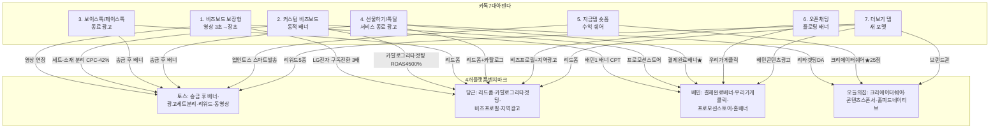
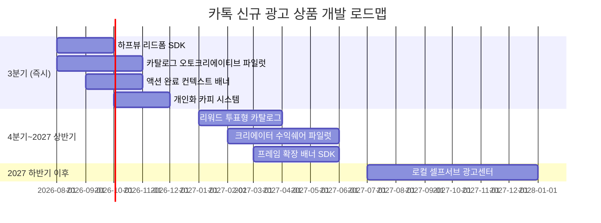

# 카카오톡 신규 광고 상품 벤치마크 종합 리포트

*작성일: 2026-07-22 · 대상: 카카오톡 광고상품 디자인 파트 · 리서치 렌즈: 비즈보드/소식칩/톡딜 확장을 위한 7대 신규 아젠다 + 전환률 높은 디스플레이 광고 신규 아이디어*

> **문서 개요**: 토스·당근·배달의민족·오늘의집 4개 플랫폼 리서치를 종합해, (1) 카톡 내부 검토중 7개 아젠다별 벤치마크 매핑, (2) 전환률 높은 디스플레이 광고 신규 아이디어 도출 두 축으로 구성. 각 플랫폼별 상세 리포트는 [platforms/](../platforms/)에서 확인. 이미지·프로세스 도식·성공 사례 심층 정리는 각 플랫폼 리포트 참고.

---

## 요약 (Executive Summary)

**리서치 스케일**
- 4개 플랫폼 광고 상품 **총 37개** 프로파일 (토스 11 · 당근 7 · 배민 10 · 오늘의집 9)
- **성공 사례 60+개** 확보 (당근 43개 최상급, 오늘의집 대형 브랜드 리스트, 토스·배민 개별 사례)
- **UI 스크린샷 76개** (토스 19 · 당근 17 · 배민 20 · 오늘의집 20)
- **Mermaid 프로세스 다이어그램 10개**

**핵심 결론 3가지**

1. **아젠다 4(선물하기·톡딜 종료 광고)가 4개 플랫폼 모두에서 최상급 벤치마크가 발견됨** — 토스 송금 후 배너, 당근 리드폼(아모레퍼시픽 상담신청 5배+), 배민 결제 완료 후 배너, 오늘의집 리타겟팅. **가장 우선 개발해야 할 아젠다**로 판단.

2. **아젠다 5(수익 쉐어 광고)는 오늘의집 크리에이터 프로그램이 국내 최상위 벤치마크** (임팩트 스코어링 25/25 만점). UGC 콘텐츠 → 상품 태그 → 판매 리워드 배분의 완결형 구조를 지금탭 숏폼에 그대로 이식 가능.

3. **아젠다 2(커스텀 비즈보드)는 "상품 피드 오토크리에이티브"가 정답** — 토스 광고세트-소재 분리(CPC -42%), 당근 카탈로그 리타겟팅(29CM ROAS 4,500%+·SSG 5배+·11번가 KPI +185%). 소재를 지면 규격에 매몰시키지 말고 원본 자산 + 지면 자동 매칭 구조로.

**추천 우선순위 (신규 개발 우선순위)**

| 순위 | 아젠다 | 벤치마크 근거 | 개발 부담 | 예상 임팩트 |
|---|---|---|---|---|
| ★1 | 아젠다 4 (서비스 종료 광고) | 4개 플랫폼 모두 실증 | 낮음 (지면 이미 존재) | 최상 |
| ★2 | 아젠다 2 (커스텀 비즈보드) | 토스+당근 성과 지표 명확 | 중간 (백엔드 개편) | 최상 |
| ★3 | 아젠다 5 (수익 쉐어) | 오늘의집 25/25점 | 높음 (신규 크리에이터 프로그램) | 상 |
| 4 | 아젠다 1 (비즈보드 영상 연장) | 당근·오늘의집 동영상 실적 | 낮음 | 상 |
| 5 | 아젠다 7 (더보기 탭 신규 포맷) | 토스 리워드+당근 리드폼 | 중간 | 중 |
| 6 | 아젠다 3 (통화 종료 광고) | 토스 액션 후 배너 | 낮음 | 중 |
| 7 | 아젠다 6 (오픈채팅 플로팅) | 당근 지역광고 (부분 차용) | 높음 (UX 리스크) | 중하 |

---

## 파트 1 · 카톡 7대 아젠다별 벤치마크 종합 매핑

### 아젠다 1 · 비즈보드 보장형 고도화 (영상 3초 → 장초)

**핵심 학습**: 동영상 연장은 소재 관리 구조가 준비되어야 성립. 토스는 "한 광고세트 안에 여러 비율(가로/세로/정방)과 이미지+영상을 동시 등록"하는 개편으로 CPC -42%, CPA -46% 달성. 당근은 LG전자 구독 전환 3배·씨드비 ROAS 200%·아케이 ROAS 500% 등 동영상 소재 실적 축적.

**최상급 벤치마크**
| 플랫폼 | 상품 | 성과 |
|---|---|---|
| 토스 | 광고세트-소재 분리 배너 | CPC -42%, CPA -46% |
| 당근 | 동영상 광고 (LG전자 구독) | 구독 전환 3배 개선 |
| 당근 | 동영상 광고 (아케이) | ROAS 500% |
| 오늘의집 | 홈피드 네이티브 카드 | 감성 큐레이션 스타일 |

**카톡 도입 방향**
- 6~15초 세로형/정방형 영상을 필수 소재로 추가
- 백엔드에 "광고세트-소재 분리" 구조 도입 (한 세트에 여러 비율 등록 → 지면 자동 매칭)
- 카카오모먼트 자동 배포 로직으로 세컨더리 지면(소식칩·오픈채팅 정보 등)에 자동 확산

---

### 아젠다 2 · 커스텀 비즈보드 (동적 스케일·포지션)

**핵심 학습**: "커스텀"의 정답은 소재를 여러 개 만드는 게 아니라 **상품 피드만으로 자동 생성되는 오토크리에이티브**. 광고주 크리에이티브 재활용률이 극대화되고 광고주 제작 부담이 대폭 감소.

**최상급 벤치마크**
| 플랫폼 | 상품 | 성과 |
|---|---|---|
| 토스 | 광고세트-소재 분리 (2026 개편) | CPC -42%, CPA -46% |
| 당근 | 카탈로그 리타겟팅 (29CM) | **ROAS 4,500%+** |
| 당근 | 카탈로그 리타겟팅 (SSG) | **ROAS 5배 이상 개선** |
| 당근 | 카탈로그 리타겟팅 (11번가) | **MAU 확대·구매 KPI +185%** |
| 오늘의집 | 스토어 스폰서드 프로덕트 | 상품 피드 오토크리에이티브 |

**카톡 도입 방향**
- 광고주는 "가로 3:1(기존) + 정방형 + 세로 4:5" 3규격만 등록, 시스템이 지면에 따라 자동 매칭
- 상품 피드(톡딜 상품 카탈로그) 활용 시 오토크리에이티브 카드 자동 생성
- 스케일·포지션 변화는 "동일 소재의 지면별 사이즈 매칭" + "카탈로그형 카드 자동 조합" 두 축으로

---

### 아젠다 3 · 보이스톡·페이스톡 종료 광고

**핵심 학습**: 액션 완료 순간은 사용자의 방어감이 낮고 성취감이 높아 광고 수용도 상승. 토스는 이 원칙을 "송금이 완료된 이후" 배너로 이미 검증. 당근 리드폼은 이 원칙을 극단화해 아모레퍼시픽 상담신청 5배+ 달성.

**최상급 벤치마크**
| 플랫폼 | 상품 | 특징 |
|---|---|---|
| 토스 | 송금 후 화면 배너 | 액션 후 성취감 활용 |
| 당근 | 리드폼 광고 (아모레퍼시픽) | 상담신청 5배+ |
| 당근 | 리드폼 광고 (한화생명) | 전환 목표 2배+ 초과 |

**카톡 도입 방향**
- 통화 종료 화면에 **디스플레이 배너 + 하프뷰 리드폼** 조합
- 통화 상대와의 관계(친구/그룹) 데이터를 프라이버시 보호 하에 광고 컨텍스트로 활용
- "5초 상담 신청" 형태의 저부담 리드폼 우선 (금융·보험·자동차·교육 카테고리)

---

### 아젠다 4 · 선물하기/톡딜 서비스 종료 광고 ★ 최우선

**핵심 학습**: **4개 플랫폼 모두에서 최상급 벤치마크가 발견됨.** 결제 완료 유저는 지불의사가 검증된 세그먼트라 CPA 효율이 매우 높음. 배민이 이미 상업적 가치를 검증했고, 당근·토스 사례로 광고 상품 유형(카탈로그·리드폼·배너)이 다각화되어 있음.

**최상급 벤치마크**
| 플랫폼 | 상품 | 성과 |
|---|---|---|
| 배민 ★ | 결제 완료 후 배너 | 카드사 CPA 광고 최적 |
| 토스 | 송금 후 배너 | 액션 완료 직후 성취감 |
| 당근 | 리드폼 (아모레퍼시픽) | 상담신청 5배+ |
| 당근 | 카탈로그 리타겟팅 (29CM) | ROAS 4,500%+ |
| 오늘의집 | 리타겟팅 DA | 최근 본 상품 카탈로그 |

**카톡 도입 방향** (3가지 형태 동시 도입 권장)
1. **결제 완료 하프뷰 배너** — 톡딜/선물하기 결제 완료 화면에 즉시 노출. 브랜드 배너 or 카드사 CPA
2. **결제 완료 리드폼** — "다음 주문 시 3천원 할인 신청" 형태로 계정 정보 자동 채움
3. **이탈 시 카탈로그 카드** — 톡딜 상세에서 뒤로가기 시 최근 본 상품 3개 카탈로그 노출

---

### 아젠다 5 · 지금탭 숏폼 수익 쉐어 광고

**핵심 학습**: 오늘의집 크리에이터 프로그램이 **국내 유일 완결형 벤치마크**. UGC 콘텐츠 → 상품 태그 → 판매 → 수익 배분의 4단계 구조가 상시 운영 중. 토스 앱인토스(pCTR 기반 자동 발송)는 개별 크리에이터 최적화 인프라의 참고.

**최상급 벤치마크**
| 플랫폼 | 상품 | 특징 |
|---|---|---|
| 오늘의집 ★ | 크리에이터 수익 쉐어 (집사) | 임팩트 스코어 25/25 만점 |
| 오늘의집 | 콘텐츠 스폰서 (집들이) | 콘텐츠에 상품 태그 자연 노출 |
| 토스 | 앱인토스 스마트 발송 | pCTR 기반 자동 최적화 |

**카톡 도입 방향**
- 지금탭 숏폼 크리에이터에게 **콘텐츠 등록 → 상품 태그 → 판매 발생 → 수익 배분** 4단계 인프라 제공
- pCTR 기반 자동 매칭으로 크리에이터가 광고 셀렉션에 개입할 필요 없음
- 초기 파일럿: 카톡 오픈채팅 방장·카톡채널 크리에이터 중 트래픽 상위 500명 대상

---

### 아젠다 6 · 오픈채팅 입력필드 위 플로팅/띠배너

**핵심 학습**: 채팅 UX는 방어벽이 가장 높은 지면 — 배너보다는 **접혀있는 링크 카드** 형태가 안전. 당근 지역광고는 하이퍼로컬 시그널을 결합해 "이 채팅방 유형과 어울리는 지역·업종 카드"를 만들 수 있는 참고 사례.

**최상급 벤치마크**
| 플랫폼 | 상품 | 참고 포인트 |
|---|---|---|
| 당근 | 비즈프로필+지역광고 | 오픈채팅 방장이 스몰비즈인 경우 |
| 당근 | 지역 네이티브 카피 | "○○동 이웃분들께" 지역명 자동 삽입 |
| 배민 | 우리가게클릭 (CPC 셀프서브) | 로컬 검색 광고 |

**카톡 도입 방향** (신중 접근)
- 채팅 입력 필드 위에는 배너 대신 **접혀있는 어필리에이트 카드**(사용자 명시적 확장 시에만 펼침)
- 채팅방 주제·참여자 지역·시간대 시그널을 결합한 컨텍스트 광고
- 초기 파일럿은 오픈채팅 특정 카테고리(취미·지역·중고거래)만 제한적 도입

---

### 아젠다 7 · 더보기 탭 신규 광고 포맷

**핵심 학습**: 더보기 탭은 능동 진입 지면이라 **참여형·리워드형·리드폼**에 적합. 토스 혜택 탭이 리워드 5종(카탈로그 투표·머니알림·행운퀴즈·미션·버튼누르기)을 집중 배치해 검증. 당근 리드폼도 능동 진입 유저에게 강력.

**최상급 벤치마크**
| 플랫폼 | 상품 | 특징 |
|---|---|---|
| 토스 | 두근두근 1등 찍기(카탈로그 투표) | 클릭률 5%, 광고 클릭 190만+ |
| 당근 | 리드폼 (신기한나라) | DB 수집 KPI 150% |
| 배민 | 배민문방구·콘텐츠 광고 | 브랜드 IP 콜라보 |
| 오늘의집 | 브랜드관 (브랜드 스토어) | 상시 운영 지면 |

**카톡 도입 방향** (2:1 배너 대체)
- **카탈로그 투표형 광고** — 6~10개 SKU 중 사용자 투표 → 광고주 랜딩. 카톡 초코·이모티콘 조각 리워드 결합
- **리드폼 카드** — 상담 신청·자료 요청 폼. 카톡 계정정보 자동 채움
- **브랜드 스토어 진입 카드** — 톡채널을 브랜드 스토어형으로 재구성

---

## 파트 2 · 전환률 높은 디스플레이 광고 신규 아이디어

전환률(CVR)을 결정하는 4개 축을 4개 플랫폼 사례에서 도출:
- **컨텍스트 축** — 사용자 행동/의도가 검증된 순간에 노출
- **개인화 축** — 광고 유닛 안에 사용자 데이터 자동 반영
- **인터랙션 축** — 광고 유닛 안에서 액션 완결 (하프뷰·인앱)
- **소재 자동화 축** — 크리에이티브를 시스템이 생성해 A/B 최적화

이 4축 조합으로 아이디어 8개를 도출:

### 아이디어 1 · Half-View Lead Form (하프뷰 리드폼) ★ 최우선

**컨셉**: 광고 클릭 시 화면 하단에서 하프뷰 시트가 올라오며 폼이 오픈됨. 카톡 계정정보(이름·연락처·주소·이메일)가 자동으로 채워짐. 사용자는 확인·제출만.

**참고 사례**
- 당근 아모레퍼시픽 리드폼: 상담신청 5배+
- 당근 신기한나라 리드폼: DB 수집 KPI 150%
- 당근 한화생명 리드폼: 전환 목표 2배+ 초과
- 당근 넥센타이어렌탈 리드폼: 유효 리드 확보

**적용 지면**: 비즈보드 · 소식칩 · 톡딜 결제 완료 · 통화 종료 · 오픈채팅 카드

**전환률이 높은 이유**
- 사용자가 앱을 떠나지 않음 (drop-off 없음)
- 카톡 계정정보 자동 채움으로 입력 부담 zero
- "무료 상담" "자료 받기" 등 저부담 CTA

**개발 스펙**
- 카톡 SDK에 폼 필드 자동 채움 API
- 광고주 시스템으로 웹훅 발송
- 대시보드에 리드 수집 이벤트마커

**우선 광고주 카테고리**: 보험·자동차·교육·부동산·금융

---

### 아이디어 2 · Catalog Auto-Creative (카탈로그 오토크리에이티브)

**컨셉**: 광고주는 **상품 피드 하나만 등록**. 시스템이 사용자 조회·장바구니 이력 기반으로 최근 본 상품 3~6개를 자동 카드화. 지면 규격에 맞춰 사이즈·레이아웃 자동 매칭.

**참고 사례**
- 당근 29CM: ROAS **4,500%+**
- 당근 SSG: ROAS **5배 이상 개선**
- 당근 11번가: MAU 확대·구매 KPI **+185%**
- 당근 무신사: 우수한 ROAS
- 토스 광고세트-소재 분리: CPC -42%, CPA -46%

**적용 지면**: 커스텀 비즈보드 (아젠다 2) · 톡딜 종료 광고 (아젠다 4) · 소식칩

**전환률이 높은 이유**
- 사용자 관심 검증된 상품만 노출 (리타겟팅)
- 오토크리에이티브로 무한 A/B 테스트 → 자동 최적화
- 광고주 제작 부담 zero → 광고주 진입장벽 대폭 하락

**개발 스펙**
- 카탈로그 상품 피드 표준 스키마 정의
- 카카오페이/톡딜 결제 픽셀 결합
- 지면별 자동 리사이즈 렌더링 엔진

**우선 광고주 카테고리**: 이커머스(패션·뷰티·가전·HMR)

---

### 아이디어 3 · Post-Action Contextual Banner (액션 완료 컨텍스트 배너) ★

**컨셉**: 톡딜/선물하기 결제 완료, 통화 종료, 이모티콘 다운로드 등 액션 완료 화면에 **컨텍스트 매칭 배너** 노출. 광고 카피는 방금 완료한 액션과 연관성이 있어야 함.

**예시 카피**
- 톡딜에서 커피 주문 후 → "다음 주문 3천원 할인 쿠폰" 재주문 유도
- 선물하기 완료 후 → "받는 사람도 답례 선물을 준비해요" 크로스 프로모션
- 통화 종료 후 → "지금 통화한 분과 함께 볼 만한 콘텐츠" (콘텐츠 광고)

**참고 사례**
- 배민 결제 완료 후 배너 (카드사 CPA 광고 정설)
- 토스 송금 후 배너 (액션 완료 직후 성취감)

**적용 지면**: 톡딜/선물하기 결제 완료 (아젠다 4) · 통화 종료 (아젠다 3) · 이모티콘 다운로드 후

**전환률이 높은 이유**
- 지불의사 검증된 세그먼트 (CPA 효율 매우 높음)
- 방금 완료한 액션과 연관성 → 광고 저항감 낮음
- 브랜드 스폰서십 스티커("이 주문은 ○○브랜드가 응원해요") 형태로 자연스러움

**개발 스펙**
- 액션 이벤트 스트림 인프라 (결제·통화 종료·다운로드)
- 컨텍스트 매칭 엔진 (액션 유형 → 광고 카테고리 매핑)
- 스폰서십 스티커 크리에이티브 템플릿

---

### 아이디어 4 · Personalized Copy Injection (개인화 카피 자동 삽입)

**컨셉**: 광고 카피에 사용자 데이터(지역명·시간대·최근 관심 카테고리)를 시스템이 자동 삽입. 광고주는 템플릿만 등록.

**예시 카피**
- "○○동 이웃분들께" (당근 스타일)
- "오늘 저녁 6시, ○○님 근처에서 열리는 이벤트" (시간+위치 결합)
- "○○님이 좋아하는 카테고리에 신상품이 도착했어요" (관심사 결합)

**참고 사례**
- 당근 지역명 자동 삽입 카피 (웅진씽크빅 지역 맞춤 사례)
- 당근 후기·거리 표시 넛지 (매출 6배·단골 3천명 사례)
- 토스 결제 데이터 기반 개인화 카피

**적용 지면**: 비즈보드 · 소식칩 · 오픈채팅 정보 탭

**전환률이 높은 이유**
- 개인화 카피는 관련성 신호가 강해 CTR 상승
- 광고주 제작 부담 없음 (템플릿만)
- 카카오 계정 데이터의 저활용 자산 활용

**개발 스펙**
- 카피 템플릿 언어 (Liquid/Jinja 스타일 `{{user.district}}`)
- 사용자 데이터 프라이버시 계층 (동의 관리)
- 크리에이티브 프리뷰 도구

---

### 아이디어 5 · Reward-Vote Catalog (리워드 투표형 카탈로그)

**컨셉**: 사용자가 6~10개 SKU 중 1개를 "커스텀 질문"에 투표. 클릭 시 즉시 리워드(카톡 이모티콘·초코 등), 투표한 상품이 1등이 되면 추가 리워드.

**참고 사례**
- 토스 두근두근 1등 찍기: **클릭률 5%, 광고 클릭 190만+**

**적용 지면**: 더보기 탭 (아젠다 7 · 2:1 배너 대체) · 톡딜 하단 · 소식칩

**전환률이 높은 이유**
- **3중 넛지**: 리워드 + 순위 미스터리 + 소셜 프루프
- 광고주 카탈로그(상품 피드) 활용 시 저공수 제작
- 사용자 능동 참여 (투표) → 광고주 브랜드 인지도 상승

**개발 스펙**
- 투표 결과 집계 시스템
- 리워드 지급 인프라 (카카오톡 이모티콘·초코·톡DP)
- 순위 발표 알림 시스템

**주의**: 카톡 스코프 제외인 "과도한 게이미피케이션" 리스크. 빈도 제한(1일 1~2회), 특정 지면 한정으로 도입.

---

### 아이디어 6 · Creator Auto-Match Revenue Share (크리에이터 자동매칭 수익쉐어)

**컨셉**: 지금탭 숏폼 크리에이터가 콘텐츠 등록 → 시스템이 pCTR 기반으로 광고 소재 자동 매칭 → 판매 발생 시 크리에이터에게 커미션 배분.

**참고 사례**
- 오늘의집 크리에이터 수익 쉐어 (집사 프로그램): 임팩트 25/25
- 오늘의집 콘텐츠 스폰서 (집들이): 임팩트 24/25
- 토스 앱인토스 스마트 발송: pCTR 기반 자동 최적화

**적용 지면**: 지금탭 숏폼 (아젠다 5) · 카톡채널 콘텐츠 · 오픈채팅 아카이브

**전환률이 높은 이유**
- 크리에이터 신뢰 자산 활용 (인플루언서 마케팅)
- 콘텐츠와 상품이 자연스럽게 결합 (광고 저항감 낮음)
- pCTR 자동 매칭으로 크리에이터 개입 최소화 → 스케일업 용이

**개발 스펙**
- pCTR 예측 모델
- 상품 태그 UI (크리에이터 도구)
- 커미션 정산 시스템
- 광고주 소재풀 관리

**초기 파일럿**: 지금탭 크리에이터 트래픽 상위 500명 대상, 커미션 8~15% 배분

---

### 아이디어 7 · Frame-Expanding Banner (프레임 확장형 배너)

**컨셉**: 클릭 시 광고 영역이 크게 확장되며 브랜드 인터랙션 페이지가 인앱으로 오픈. 사용자는 이벤트 참여·쿠폰 발급·투표를 광고 안에서 완결. 하프뷰 시트 형태로 마감.

**참고 사례**
- 토스 광고세트-소재 분리의 인앱 랜딩(하프뷰) 스펙
- 배민 프로모션 스토어 (인앱 미니 랜딩)
- 오늘의집 브랜드관 (인앱 스토어)

**적용 지면**: 커스텀 비즈보드 (아젠다 2) · 소식칩

**전환률이 높은 이유**
- 사용자가 앱을 떠나지 않음 (drop-off 없음)
- 인터랙션이 광고 유닛 안에서 완결 (전환 경로 짧음)
- 시각적 임팩트가 커서 브랜드 인지도·회상률 상승

**개발 스펙**
- 프레임 확장 애니메이션 SDK
- 하프뷰 시트 컴포넌트
- 브랜드 인터랙션 페이지 템플릿 (이벤트·쿠폰·투표·미니게임)
- iOS/Android 네이티브 통합

---

### 아이디어 8 · Local Self-Serve Ad Center (로컬 셀프서브 광고센터)

**컨셉**: 오픈채팅 방장·카톡채널 사업자·카카오맵 소상공인이 직접 광고를 개설·집행·중단할 수 있는 셀프서브 광고센터. 위치·카테고리 자동 매칭 + 초저가 CPC.

**참고 사례**
- 당근 비즈프로필+지역광고: 소상공인 43+개 사례, "매일 1만원으로 신규 고객 1명씩"
- 배민 우리가게클릭: 30만+ 소상공인 셀프서브
- 배민 오픈리스트: 지역 상단 3슬롯 정액제

**적용 지면**: 오픈채팅 지역·업종 카드 (아젠다 6) · 카톡채널 홈 · 카카오맵 상단

**전환률이 높은 이유**
- 소상공인 진입장벽 대폭 하락 → 광고주 저변 폭발적 확대
- 셀프서브 → 광고 매출의 롱테일 형성
- 로컬 컨텍스트로 광고 관련성 상승

**개발 스펙**
- 셀프서브 대시보드 (모바일 최적화)
- 위치·카테고리 자동 매칭 엔진
- 예산 자동 관리 (충전·중단·재개)
- 초저가 CPC 입찰 시스템

---

## 파트 3 · 도입 우선순위 매트릭스

각 아이디어를 (a) 개발 부담, (b) 예상 임팩트, (c) 벤치마크 신뢰도 3축으로 평가.

| 아이디어 | 개발 부담 | 예상 임팩트 | 벤치마크 신뢰도 | 종합 우선순위 |
|---|:---:|:---:|:---:|:---:|
| 1. 하프뷰 리드폼 | 중 | 최상 | 최상 (당근 실증) | **★1** |
| 2. 카탈로그 오토크리에이티브 | 중 | 최상 | 최상 (당근·토스 실증) | **★2** |
| 3. 액션 완료 컨텍스트 배너 | 낮 | 상 | 상 (배민·토스) | **★3** |
| 4. 개인화 카피 자동 삽입 | 낮 | 상 | 상 (당근) | 4 |
| 5. 리워드 투표형 카탈로그 | 중 | 중상 | 상 (토스 190만 클릭) | 5 |
| 6. 크리에이터 수익쉐어 | 상 | 상 | 최상 (오늘의집 25/25) | 6 |
| 7. 프레임 확장 배너 | 상 | 상 | 상 (토스·배민·오늘의집) | 7 |
| 8. 로컬 셀프서브 광고센터 | 최상 | 상 (롱테일) | 최상 (당근·배민 실증) | 8 |

**3분기 즉시 도입 후보**: 아이디어 1·2·3·4 (개발 부담 낮음~중간, 임팩트 상~최상, 벤치마크 신뢰도 최상)

**4분기~2027 상반기 도입 후보**: 아이디어 5·6·7 (개발 부담 중간~상, 신규 인프라 필요)

**중장기(2027 하반기 이후)**: 아이디어 8 (로컬 셀프서브는 카톡 광고 조직·정책 개편 필요)

---

## 파트 4 · 카톡 광고 지면 확장 로드맵 (제안)

---

## 파트 5 · 팀 논의를 위한 열린 질문

**A. 개인정보·프라이버시**
- 카톡 계정정보 자동 채움(리드폼)은 개인정보처리방침 개정 필요? 옵트인 UX 어떻게 설계?
- 통화 종료 화면에서 통화 상대와의 관계 데이터 활용은 프라이버시 관점에서 어디까지 가능?

**B. UX 방어선**
- 오픈채팅에 광고 도입 시 사용자 반발 리스크는? 파일럿 카테고리를 어떻게 좁힐지?
- "과도한 게이미피케이션 배제" 원칙 안에서 리워드 투표형 카탈로그를 어떻게 규제할지?

**C. 광고 매출 전략**
- 소상공인 셀프서브 인벤토리(롱테일) vs 대형 브랜드 프리미엄(빅헤드) 어떤 축을 먼저?
- 크리에이터 커미션율(권장 8~15%) 검토는 어느 조직에서?

**D. 성과 측정**
- ROAS 지표는 이커머스 광고주만 측정 가능. 리드폼·브랜드 광고는 어떤 KPI로 광고주에게 제시할지?
- 아젠다별 초기 A/B 테스트 설계 (전환률 벤치마크 대비)

---

## 부록 · 4개 플랫폼 리서치 상세 리포트 링크

- [토스 광고 상품 리서치 리포트](../platforms/toss/) — 11개 상품, 이미지 19개, mermaid 3개
- [당근 광고 상품 리서치 리포트](../platforms/daangn/) — 7개 상품, 이미지 17개, mermaid 3개, **성공사례 43+개**
- [배달의민족 광고 상품 리서치 리포트](../platforms/baemin/) — 10개 상품, 이미지 20개, mermaid 2개
- [오늘의집 광고 상품 리서치 리포트](../platforms/ohou/) — 9개 상품, 이미지 20개, mermaid 2개

---

*이 종합 리포트는 4개 플랫폼 개별 리포트의 요약본이 아니라 **아젠다·아이디어 관점의 재구성본**입니다. 각 아이디어의 상세 근거·성공사례·수치는 각 플랫폼 리포트에서 확인하세요. 우선순위·개발 부담·임팩트 평가는 이 리서치 세션에서 관찰된 데이터 기반의 추정이므로, 실제 도입 결정 전 광고 조직·기술 조직과의 별도 검토가 필요합니다.*
